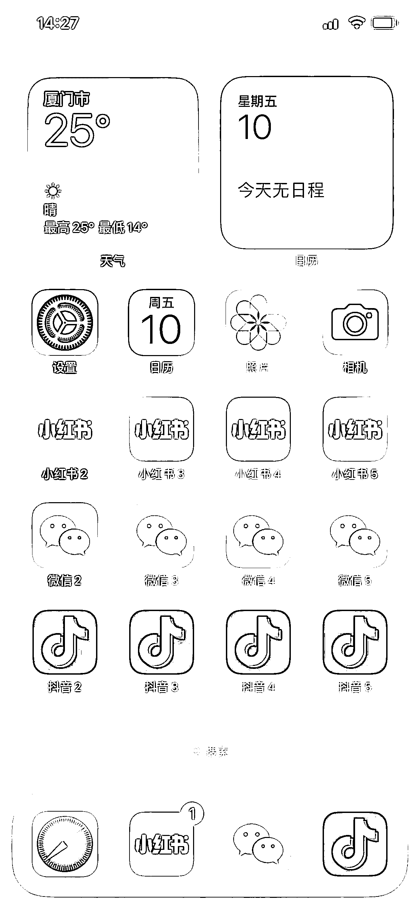

# 苹果手机多开项目，操作方法

> 原文：[`www.yuque.com/for_lazy/xkrm14/ww9xmf9wx9tffdsi`](https://www.yuque.com/for_lazy/xkrm14/ww9xmf9wx9tffdsi)

作者： 白露听雨 

日期：2023-03-10 

点赞数：53 

正文： 

花了半天研究了下 ios 砸壳、签名、分发的教程 然后发现网上有一些专门卖证书的、比如内测侠，dumpapp，直接百度第一个就是 每个网站都有自家的配套教程，按照教程一步一步走，就能走通 费用是一机一证，证书根据稳定情况价格 35-100 不等 只要买一个证书，这个手机就可以几乎无限开所有应用 对做项目的朋友应该有帮助 另外有流量的朋友还可以去做他们的代理，我看淘宝上很多卖多开的就是用的这种 

  

评论区： 

姚姚姚姚老板。 : 这个意思是把微信重新加壳和证书 重新打个包 就可以实现多开？ 

闲米 : 我就是做逆向的，这个方法是可行的，但是有几大问题：1.这种多开微信规避不了封号；2.多开的微信签名过期了需要重新再安装；3.微信一些更新之后有的会出现打不开或者打开闪退的情况 

波叔 : 这个是不是要对手机刷机才行 

白露听雨 : 不需要的 

浮生 : 同一个指纹信息，在现在检测这么卷的环境下感觉没什么意义，还是老老实实一机一卡一号吧 

