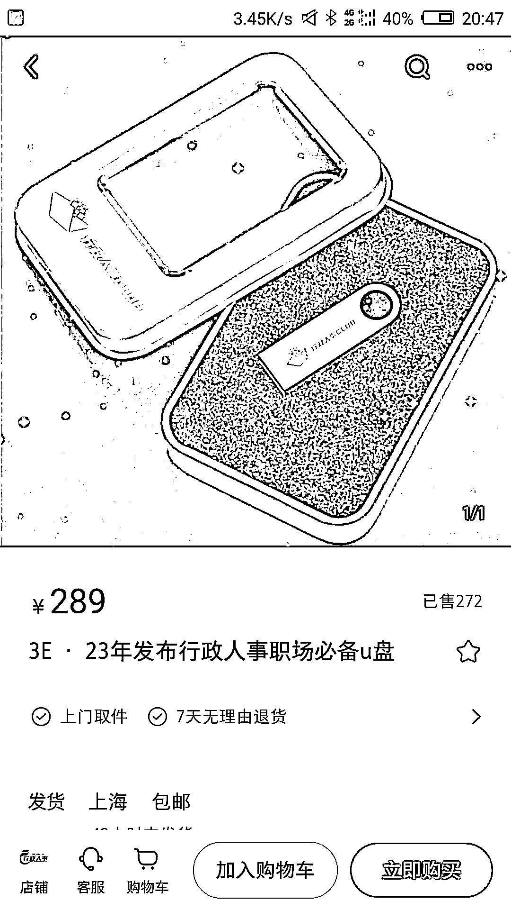

# 小红书商店利用 U 盘卖虚拟资料

> 原文：[`www.yuque.com/for_lazy/xkrm14/ugcwnznv81wit4eo`](https://www.yuque.com/for_lazy/xkrm14/ugcwnznv81wit4eo)

作者： 蓝子鱼 

日期：2023-03-10 

点赞数：152 

正文： 

小红书商店里面刷到这个卖 u 盘的，一个还卖 289，利润应该至少 260，卖了 272 份，这个可以延伸到很多领域，比如财务，法律，学科资料…… 

  

评论区： 

赈早见海 : 倒是资料引流项目在小红书内成交的不错方法，因为店铺不能直接上架虚拟商品，可以把资料放在 U 盘里交付，而且再在里面放引流图片做后续转化就很简单了 

重生 Break : 一个优盘卖这么贵 真有人买吗 

蓝子鱼 : 肯定有人买，你不会买只能说明你不是它的目标客户，还有你可能没有做过销售，这个卖的不是 u 盘，是一套完整的行政人事工作表格，如果自己做你想想要花多少时间。 

重生 Break : 我还以为就是单纯的卖个优盘 

朱维涛 : 卖过给老年人的太极拳视频 u 盘，这个 u 盘成本才几块钱。但老人家售后麻烦，又有版权隐患，就不做了。表格这种没版权的还是不错的，我经常临时需要的时候想找个模板，一看都要收几块钱才给下载。 

💪🏻吉吉积极向上 : 优盘是物品，里面的东西才是想要的，绝了！换种方式为知识付费，尤其拿到优盘是一种踏实感！ 

啊明 : 7 天退货，如果客户收到资料拷电脑上又退货呢。 

蓝子鱼 : 一个利润超 10 倍的产品，退货率应该不是主要问题吧 

