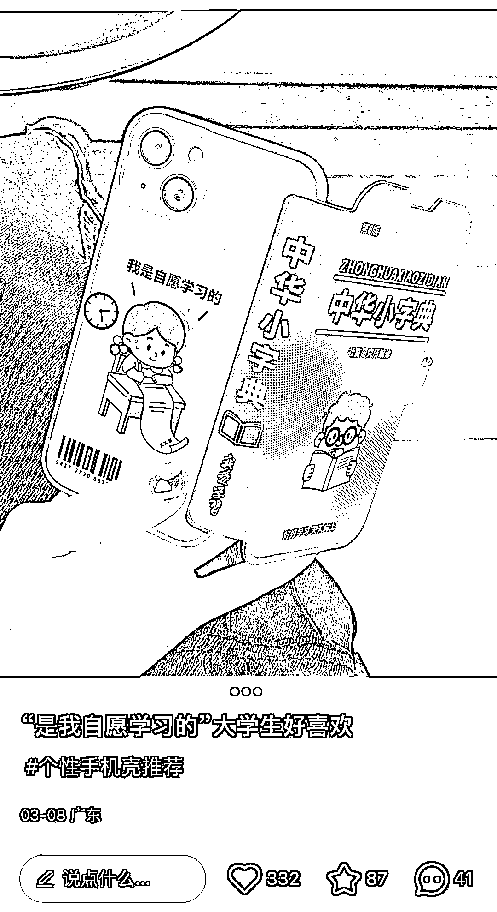
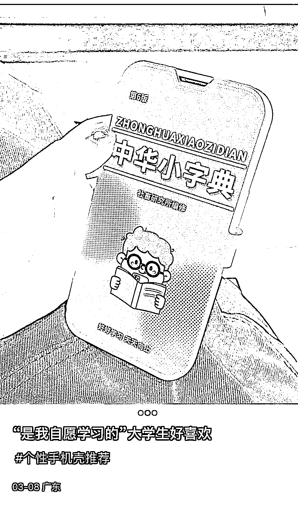
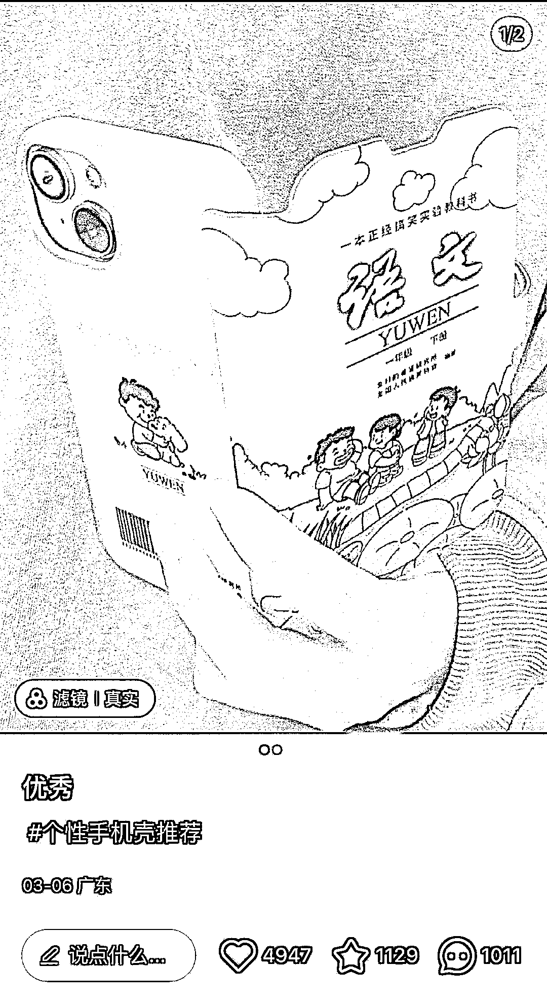

# 小红书教科书手机壳，个性化产品受欢迎

> 原文：[`www.yuque.com/for_lazy/xkrm14/loar253ska1c389n`](https://www.yuque.com/for_lazy/xkrm14/loar253ska1c389n)

作者： hepingfly 

日期：2023-03-10 

点赞数：114 

正文： 

小红书教科书手机壳，底下都是想要怎么买 

  

  

 

 

  

  

评论区： 

波叔 : 这个有点儿意思，点燃好奇心 

COLIN : 这个淘宝上有销售，1688 批发价格是售价一半左右 

爪爪 : 感觉还可以针对中小学生，出那种公式定理的手机壳。 

hepingfly : 目标用户应该不是学生，而是那种对新奇特/反差感兴趣的年轻人 

詹伟平 : 很有创意 

