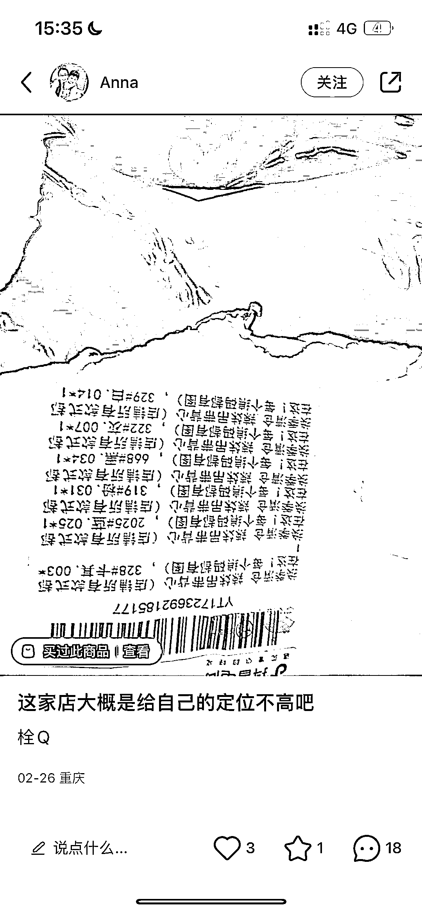

# 小红书开通一个店铺就可以实现批量素人带货

> 原文：[`www.yuque.com/for_lazy/xkrm14/dxlgwsd2ix9ekx89`](https://www.yuque.com/for_lazy/xkrm14/dxlgwsd2ix9ekx89)

<ne-p id="u09d7da9a" data-lake-id="u09d7da9a"><ne-text id="uad634dd9">作者： 📌小攀师兄</ne-text></ne-p> <ne-p id="ubfb7fc7b" data-lake-id="ubfb7fc7b"><ne-text id="ucd78c09e">日期：2023-03-10</ne-text></ne-p> <ne-p id="u48435f34" data-lake-id="u48435f34"><ne-text id="ud0fc6d21">点赞数：</ne-text><ne-text id="u520d5179" ne-bold="true">62</ne-text></ne-p> <ne-hole id="u26df58ec" data-lake-id="u26df58ec"><ne-card data-card-name="hr" data-card-type="block" id="wcMWl" data-event-boundary="card"><ne-p id="u537d3b4b" data-lake-id="u537d3b4b"><ne-text id="u1b263922">正文：</ne-text></ne-p> <ne-p id="uf08b77b9" data-lake-id="uf08b77b9"><ne-text id="u1cf165ed">小红书开通一个店铺就可以实现批量素人带货！ 很多人不知道我们应该如何像抖音小店一样去重复性带货，或者说有小号但是不能实名带货，可以通过素人去铺货小红书。</ne-text> <ne-text id="u40e78637">操作：小号购买你的店铺产品，在进行发笔记引流带货，成功实现大批量素人带货，且素人的流量相对于其他的要好一点！</ne-text></ne-p> <ne-p id="u2a36a02e" data-lake-id="u2a36a02e"><ne-card data-card-name="image" data-card-type="inline" id="jdMzt" data-event-boundary="card">  <ne-p id="u04a70ffb" data-lake-id="u04a70ffb"><ne-card data-card-name="image" data-card-type="inline" id="Dg8AW" data-event-boundary="card">  <ne-hole id="uc49d0ca3" data-lake-id="uc49d0ca3"><ne-card data-card-name="hr" data-card-type="block" id="h7lce" data-event-boundary="card"><ne-p id="uf3356dc1" data-lake-id="uf3356dc1"><ne-text id="uc62491ef">评论区：</ne-text></ne-p> <ne-p id="u6ef19e32" data-lake-id="u6ef19e32"><ne-text id="u7186d53a">暂无评论</ne-text></ne-p> <ne-hole id="uc5d3ad59" data-lake-id="uc5d3ad59"><ne-card data-card-name="hr" data-card-type="block" id="o464P" data-event-boundary="card"><ne-p id="ue1800747" data-lake-id="ue1800747"><ne-text id="uf3b9a04a">公众号懒人找资源，懒人专属群分享</ne-text></ne-p></ne-card></ne-hole></ne-card></ne-hole></ne-card></ne-p></ne-card></ne-p></ne-card></ne-hole>