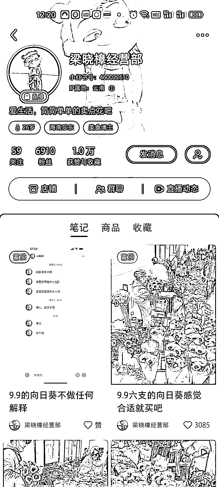
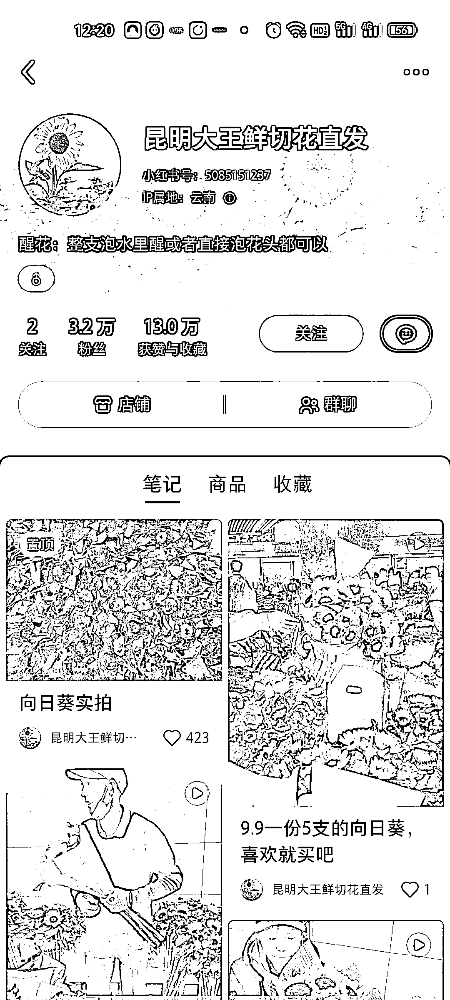

# 小红书上卖鲜花

> 原文：[`www.yuque.com/for_lazy/xkrm14/ilr11lk5dptfn4vo`](https://www.yuque.com/for_lazy/xkrm14/ilr11lk5dptfn4vo)

作者： 小椰 

日期：2023-03-10 

点赞数：43 

正文： 

小红书上卖鲜花 最近刷小红书看到卖向日葵的 9.9 元包邮 5 支特别便宜 我在线下花店买要 9 块钱一支 就下单买了一次 收到还是很惊艳的 可以说性价比很高了 卖向日葵小红书上相关账号特别多，账号数据也不错，在昆明的朋友可以利用产地优势做鲜花一件代发，其他地方特产这个思路也可以借鉴。 

 

  

  

  

评论区： 

💪🏻吉吉积极向上 : 我买了哈哈，感谢小椰分享 

小椰 : 哈哈，没想到这风向标还有种草作用 

詹伟平 : 9.9 元还能赚钱 

Eleven : 我也买了，哈哈哈 

