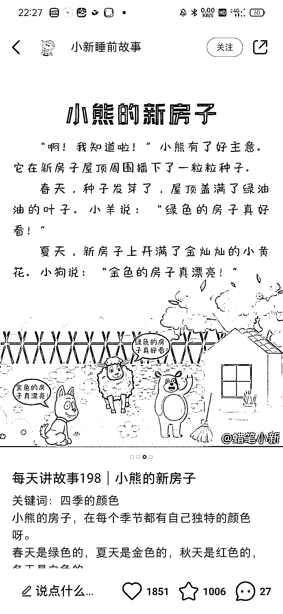

# 小红书宝宝讲故事号，操作变现思路

> 原文：[`www.yuque.com/for_lazy/xkrm14/xf3iez6vc03ez88b`](https://www.yuque.com/for_lazy/xkrm14/xf3iez6vc03ez88b)

作者： 土豆君 

日期：2023-03-09 

点赞数：48 

正文： 

刷绘本刷到了讲故事的小红书号。 每天晚上发一个小故事，配上图片，模式很简单。 这个用 AI 来做，非常容易，chatGPT 出故事短文案，midjourney、SD 画图，很容易批量产出内容。 很多宝妈有给宝宝讲故事需要，他们会偏向于关注这个号，每天定时打开，给宝宝讲故事。 变现方式就很多了，宝妈群体已有的变现方式都可以尝试，可以用来引流私域，也可以尝试众筹出 AI 绘本合集等等。 

  

评论区： 

文武兄弟 : ai 画很难控制主体动作，表情，人物长相 

土豆君 : 不要紧 

文武兄弟 : 刚才搞了一下，就卡在六张图片这了 

文武兄弟 : 那怎么搞 

土豆君 : 背景和动物可以分开画，笔记的图片质量也不高，我觉得差不多就行了～[呲牙] 

文武兄弟 : [小红书](http://xhslink.com/11MuYn) 

土豆君 : 执行力强...😃 

