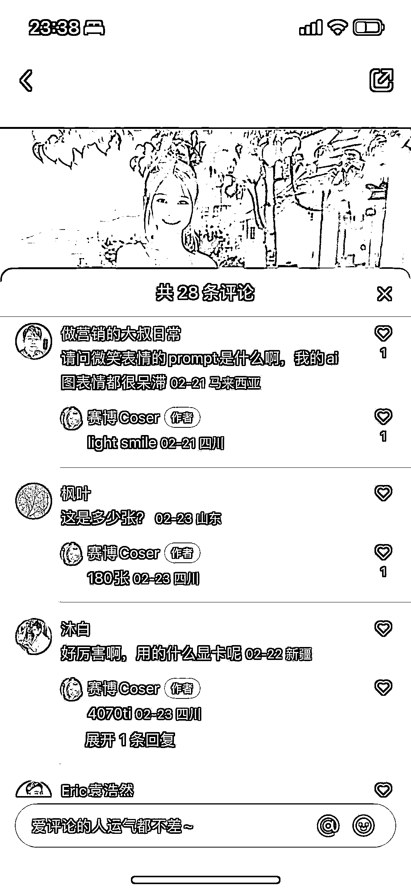

# 小红书 AI 绘画，美女账号做差异化

> 原文：[`www.yuque.com/for_lazy/xkrm14/taga66kwdo8k3sr0`](https://www.yuque.com/for_lazy/xkrm14/taga66kwdo8k3sr0)

<ne-p id="ue247e85f" data-lake-id="ue247e85f"><ne-text id="u0c603449">作者： 高杰</ne-text></ne-p> <ne-p id="u37d79d16" data-lake-id="u37d79d16"><ne-text id="ue16ebd12">日期：2023-03-06</ne-text></ne-p> <ne-p id="uec3d3b11" data-lake-id="uec3d3b11"><ne-text id="u3ba56179">点赞数：</ne-text><ne-text id="uc44e390e" ne-bold="true">41</ne-text></ne-p> <ne-hole id="u6dc605e0" data-lake-id="u6dc605e0"><ne-card data-card-name="hr" data-card-type="block" id="nx7Gl" data-event-boundary="card"><ne-p id="uff99c238" data-lake-id="uff99c238"><ne-text id="ucf68f4eb">正文：</ne-text></ne-p> <ne-p id="ubab6cdc0" data-lake-id="ubab6cdc0"><ne-text id="u9e6c03b2">这应该是我看了那么多小红书 AI 绘画里面做差异化做的还不错的账号 不出意外很快就能火，而且还能有不错的变现收益</ne-text> <ne-text id="u33037712">这个账号区别于其他完全只是放图片的账号，他把一个模型做了非常多的微调以后生成了超多的图片，然后做成了滚动变装视频，比如他自己在评论说的 180 张做了一个 20 秒左右的视频</ne-text> <ne-text id="ue4d70e2e">我谈谈我的理解 1、和其他所有的商业竞争一样，只要比别人稍微改进一点点，就能产生差异化，让人记住你，这个账号总共 10 多条视频点赞关注数据还是不错的</ne-text> <ne-text id="u07ec8ac5">2、AI 绘画和 chatgpt 的出现不用说，变现的机会确实多，不过还是需要和自己认知和能力匹配</ne-text> <ne-text id="u00cc2093">3、他把方向改成了用 AI 模特，结合做穿搭，说不定未来是有不错的机会，如果再结合服装品牌合作，或者某些服装平台可以参考 AI 绘画做的比较好的产品做成成品，也不见得不行</ne-text></ne-p> <ne-p id="u449b22b9" data-lake-id="u449b22b9"><ne-card data-card-name="image" data-card-type="inline" id="jx4c8" data-event-boundary="card"></ne-card></ne-p> <ne-p id="ub76afd5c" data-lake-id="ub76afd5c"><ne-card data-card-name="image" data-card-type="inline" id="SXiFc" data-event-boundary="card"></ne-card></ne-p> <ne-p id="u0663e303" data-lake-id="u0663e303"><ne-card data-card-name="image" data-card-type="inline" id="RNcm1" data-event-boundary="card"></ne-card></ne-p> <ne-hole id="ua546edaf" data-lake-id="ua546edaf"><ne-card data-card-name="hr" data-card-type="block" id="FHk4M" data-event-boundary="card"><ne-p id="u1887da6f" data-lake-id="u1887da6f"><ne-text id="u4eec2659">评论区：</ne-text></ne-p> <ne-p id="ube2d4796" data-lake-id="ube2d4796"><ne-text id="u7a26431d">厚德载物</ne-text><ne-text id="u70447fcd" ne-sup="true">O</ne-text><ne-text id="u4f0e4201">洪永安 : 问下，这个图片的账户是抖音平台吗？还是其他平台</ne-text></ne-p> <ne-p id="ud5cbdc31" data-lake-id="ud5cbdc31"><ne-text id="u8b3f88a6">高杰 : 小红书</ne-text></ne-p> <ne-p id="u6767eaf2" data-lake-id="u6767eaf2"><ne-text id="u89d4d765">小小少年 : 问下这类 AI 制美女图账号是靠什么来变现的么</ne-text></ne-p> <ne-p id="uf6be36aa" data-lake-id="uf6be36aa"><ne-text id="u46ea167a">浅色海洋の鱼 : 定制</ne-text></ne-p> <ne-hole id="u1e556b20" data-lake-id="u1e556b20"><ne-card data-card-name="hr" data-card-type="block" id="LGvGX" data-event-boundary="card"><ne-p id="uf2c10643" data-lake-id="uf2c10643"><ne-text id="ud46d4dbf">公众号懒人找资源，懒人专属群分享</ne-text></ne-p></ne-card></ne-hole></ne-card></ne-hole></ne-card></ne-hole>