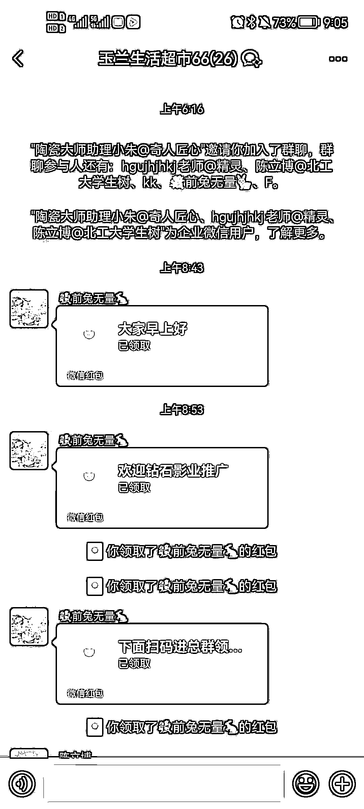
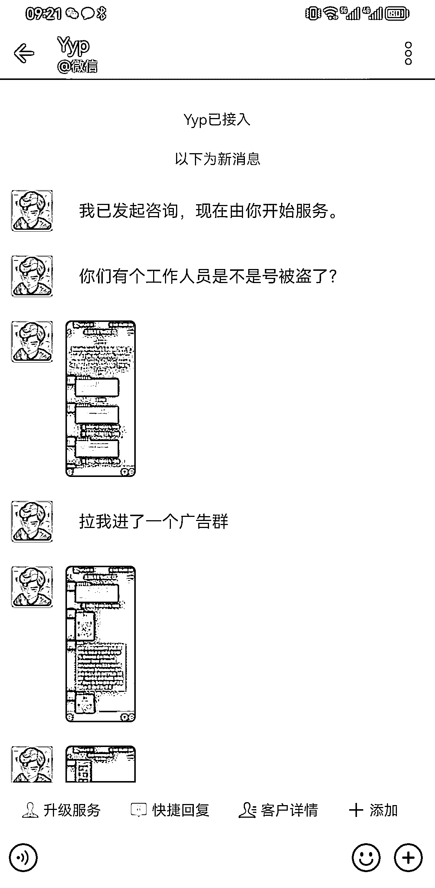
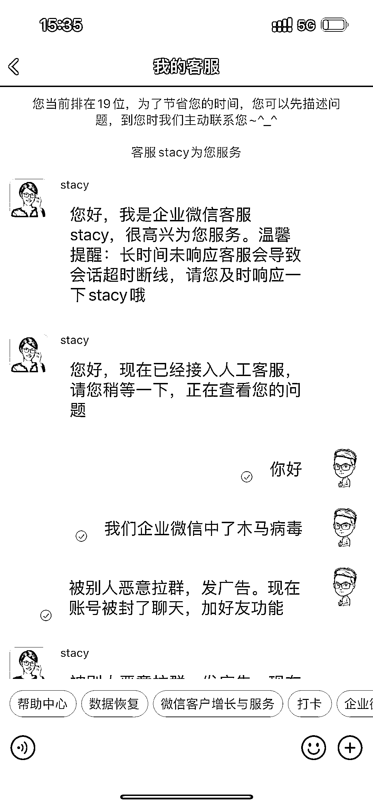
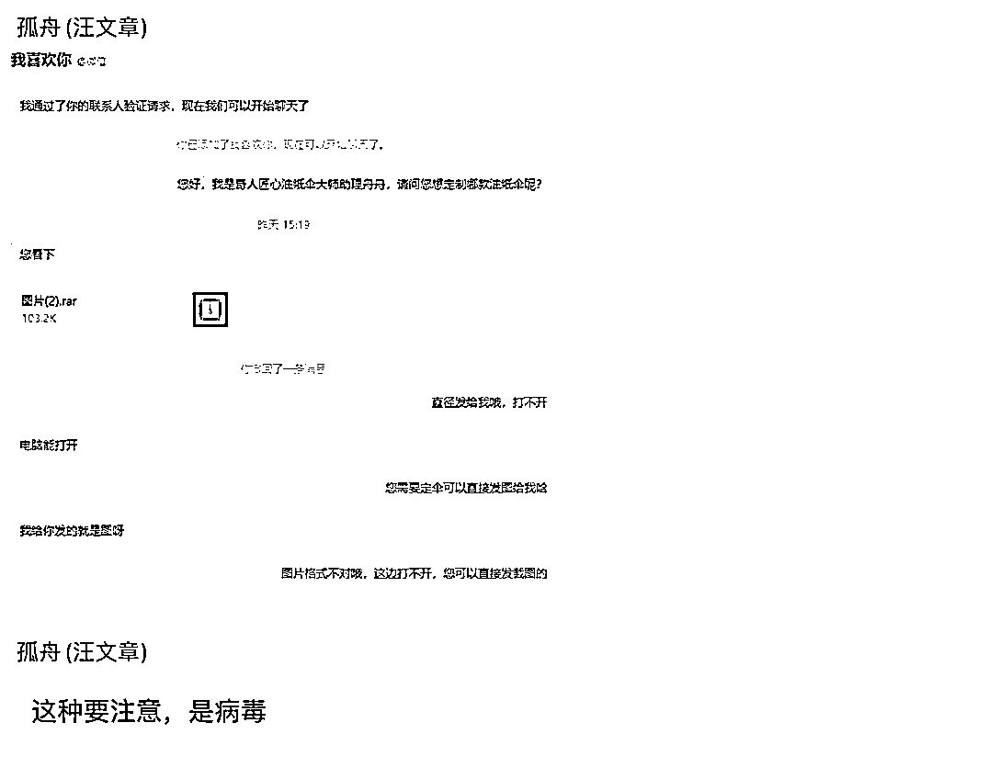

# 留意企业微信木马病毒诈骗

> 原文：[`www.yuque.com/for_lazy/xkrm14/tcd7p8b2igk98gx3`](https://www.yuque.com/for_lazy/xkrm14/tcd7p8b2igk98gx3)

作者： 马克图布 

日期：2023-03-10 

点赞数：60 

正文： 

注意了⚠️留意企业微信木马病毒诈骗。 前几天我们的企业微信被一个人集体加了，他加了我们所有的企业微信，然后给我们发了一个压缩包，让我们客服打开看图片。 其实里面植入的是木马病毒，然后我们有同事就把这个压缩包给打开了，结果它微信就中毒了。 当天夜里的话，这个人就控制了我们的电脑，把他企业微信拉各种客户群，然后发广告。 然后我们企业微信被客户投诉之后，微信就把我们账号给封掉了。然后我们就找客服去申诉，终于救回来了。 大家也可以去那个查一下你们的企业微信是否遇到这样的情况，有人加了你所有的微信号，然后发压缩包，让你打开看图片。太贼了。 

  

  

  

  

  

  

  

评论区： 

亦仁 : 其他人注意 

安夏 : 我们团队今天也遇到了。踩坑经历分享给大家，各位可以借鉴跟团队做防诈骗宣传，避免踩坑[生财有术·精华帖索引工具 2.0](https://search01.shengcaiyoushu.com/activity/task/detail?stage_id=3759&number=36929) 

马克图布 : 太可恶了真的 

竹影 : 个人微信能控制吗 

马克图布 : 我估计都能控制 

