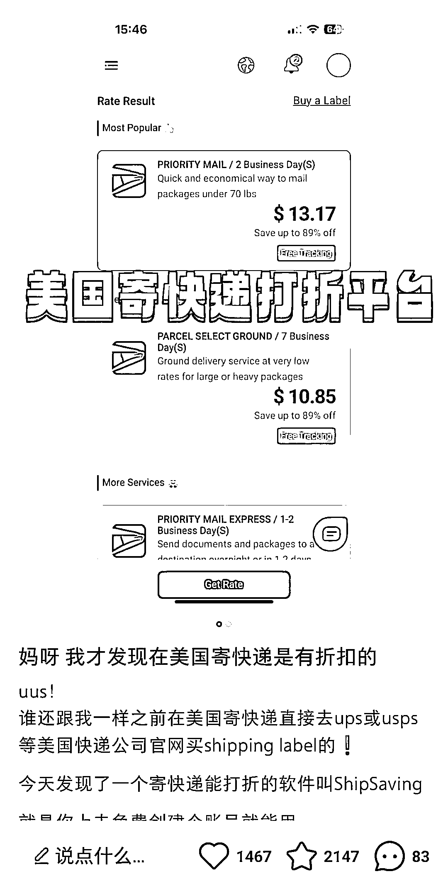
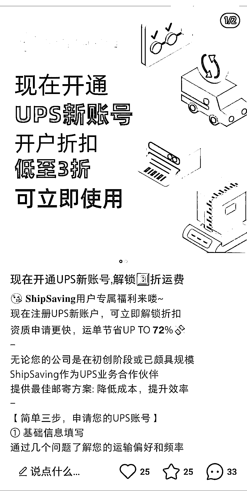

# 快递 cps 之美国版

> 原文：[`www.yuque.com/for_lazy/xkrm14/qhfa94rkuciqsr3r`](https://www.yuque.com/for_lazy/xkrm14/qhfa94rkuciqsr3r)

作者： 米笠 

日期：2023-03-10 

点赞数：33 

正文： 

快递 cps 之美国版 今天往国内寄身份证花了 160 刀 才发现小红书有更便宜的折扣码 美国的服务商与几大快递公司 UPS，FedEx 有协议价 然后通过分包的形式给到小服务商。 小服务商再找客户赚差价。 跟国内快递 CPS 操作思路一样，客利润更高。 麻烦的一点是需要引流到私域下单，或者是自建工具平台。 

  

  

评论区： 

NBC 二当家的 : 国内怎么揽收，这种好像揽收点很少。 

Martin-黄林 : 可以让别人寄到你指定的地点 

NBC 二当家的 : 懂了，价格应该没有他们做跨境电商的联系吧。 

