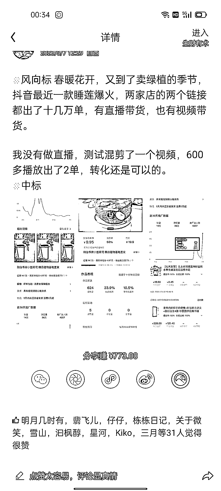

# 去年春季卖爆的睡莲，今年大概率也能爆

> 原文：[`www.yuque.com/for_lazy/xkrm14/vkqnm9xa0xzgyxhx`](https://www.yuque.com/for_lazy/xkrm14/vkqnm9xa0xzgyxhx)

<ne-p id="u16e5771c" data-lake-id="u16e5771c"><ne-text id="u65884336">作者： 明月几时有</ne-text></ne-p> <ne-p id="uc3d92ac7" data-lake-id="uc3d92ac7"><ne-text id="ubacbc92c">日期：2023-03-10</ne-text></ne-p> <ne-p id="ufdeddc01" data-lake-id="ufdeddc01"><ne-text id="uabffccbb">点赞数：</ne-text><ne-text id="u3a10656d" ne-bold="true">46</ne-text></ne-p> <ne-hole id="uf3fc77c1" data-lake-id="uf3fc77c1"><ne-card data-card-name="hr" data-card-type="block" id="J78bK" data-event-boundary="card"><ne-p id="u049e16dd" data-lake-id="u049e16dd"><ne-text id="u77d03093">正文：</ne-text></ne-p> <ne-p id="ue78426a3" data-lake-id="ue78426a3"><ne-text id="u73362102">大家快试试去年春季卖爆的睡莲，今年大概率也能爆</ne-text></ne-p> <ne-p id="uf23a4d28" data-lake-id="uf23a4d28"><ne-card data-card-name="image" data-card-type="inline" id="gkku9" data-event-boundary="card">  <ne-p id="u24a8c38a" data-lake-id="u24a8c38a"><ne-card data-card-name="image" data-card-type="inline" id="sZNSd" data-event-boundary="card">  <ne-hole id="u2c3b32cf" data-lake-id="u2c3b32cf"><ne-card data-card-name="hr" data-card-type="block" id="RpeXI" data-event-boundary="card"><ne-p id="u7ed54928" data-lake-id="u7ed54928"><ne-text id="uf1015a46">评论区：</ne-text></ne-p> <ne-p id="u3b1d4bc1" data-lake-id="u3b1d4bc1"><ne-text id="ueea52f0a">黄小刀🔪 : [流泪][流泪]这是碗莲，去年我们游戏队友全部都种了，只有一个开花了</ne-text></ne-p> <ne-hole id="u8f48fa33" data-lake-id="u8f48fa33"><ne-card data-card-name="hr" data-card-type="block" id="p9xzS" data-event-boundary="card"><ne-p id="ue7745800" data-lake-id="ue7745800"><ne-text id="u3dd0b8ac">公众号懒人找资源，懒人专属群分享</ne-text></ne-p></ne-card></ne-hole></ne-card></ne-hole></ne-card></ne-p></ne-card></ne-p></ne-card></ne-hole>