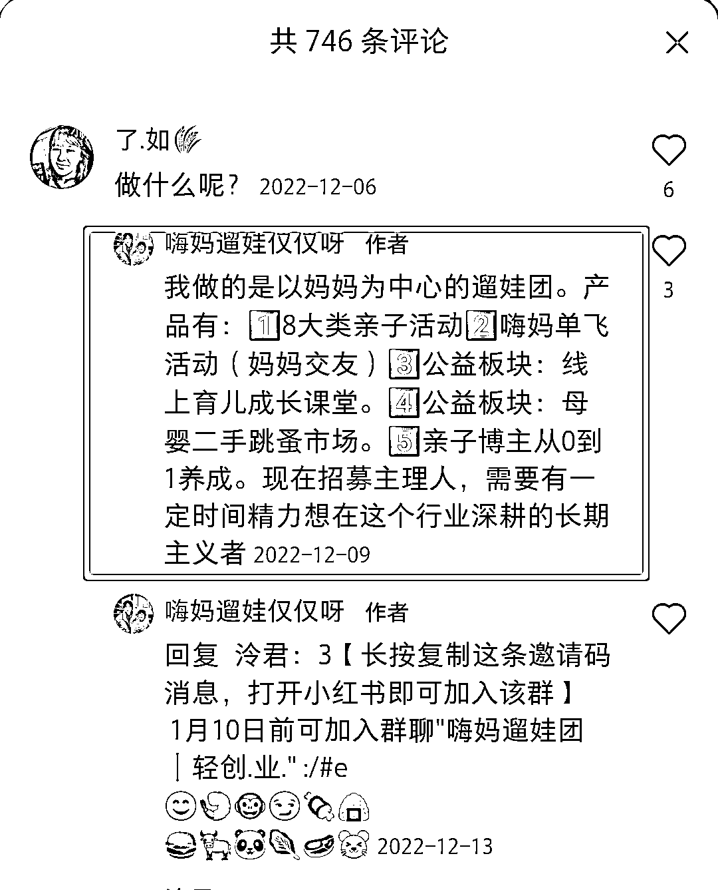

# 小红书创建亲子社群，引流宝妈粉

> 原文：[`www.yuque.com/for_lazy/xkrm14/hpp3gkl0c1g9x1eh`](https://www.yuque.com/for_lazy/xkrm14/hpp3gkl0c1g9x1eh)

作者： 梨儿长大 

日期：2023-03-09 

点赞数：63 

正文： 

妈妈群妈妈团 以无收入妈妈为目标用户，工作为钩子。 在小红书大量引流，小红书留言区爆满，都在求如何进…目前博主在长沙，其他地方招募中 有相同资源的小伙伴可以考虑蹲守复制 

  

  

  

评论区： 

lydia : 后面怎么变现 

三生 : 评论哪里就是变现 

lalalaLiz : 应该是组织活动本身可以收钱，其他地方招募代理人也是一笔费用，这么多妈妈资源还可以好物优选好课优选 

西琪💫 : 我认真看了这个项目，居然很心动💓 

梨儿长大 : 感觉加入摸底搞起✌ 

西琪💫 : 不知福加入费用高不高？生财马上就要续费了，孩子也是各种班需要续费 

梨儿长大 : 不好意思没有说清楚，可以先进对方的小红书群观察，了解，看看他们在搞什么，再决定要不要加入。也可以发星球，向大佬提问，再做决定 

西琪💫 : 这个可以 

