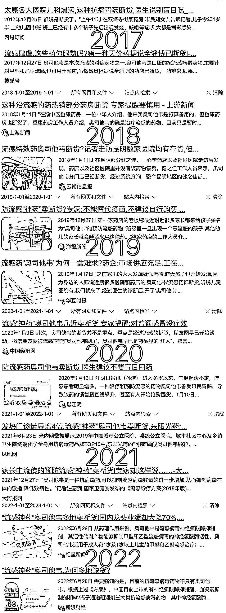
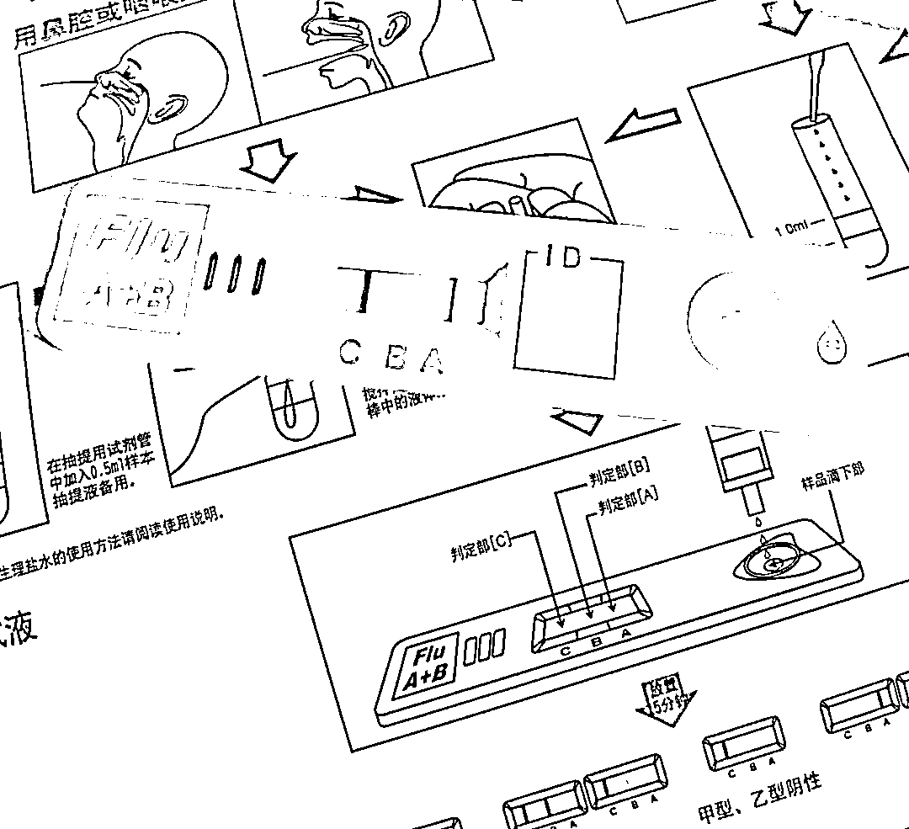

# 甲流相关内容和咽拭子等产品，可提前布局

> 原文：[`www.yuque.com/for_lazy/xkrm14/nrzusxgapwime3hs`](https://www.yuque.com/for_lazy/xkrm14/nrzusxgapwime3hs)

作者： 包子 

日期：2023-03-08 

点赞数：21 

正文： 

甲流相关内容和咽拭子 感染甲流还是挺难受的，体感上就是一个小新冠，得发烧好几天。 而且每年流感都会来一次，每年奥司他韦都卖断货，提前布局相关的内容是不是一个思路呢？ 因为奥司他韦需要发病后 48 小时吃，那么意味着检测手段得非常及时。 这时，甲流咽拭子就是最快最方便的手段了。 问了附近好几家小医院，都做不了甲流抗原测试，得个流感又不至于去趟三甲医院寻求确诊。 甲流咽拭子药店也准备得很少，美团买药送货需要 1-3 天，几乎快错过黄金时间了，哪个妈妈能等那么久？ 其他的季节性传染病是不是也有这个思路呢？ 

 

 

评论区： 

暂无评论 

