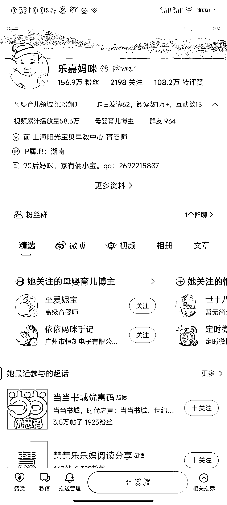
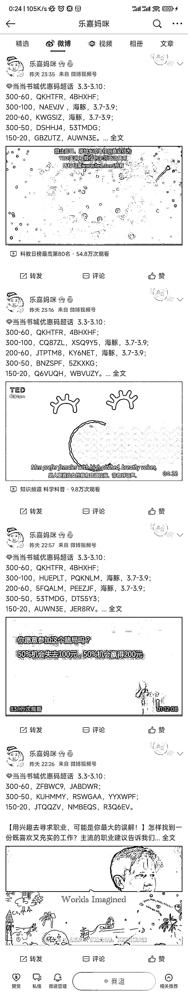
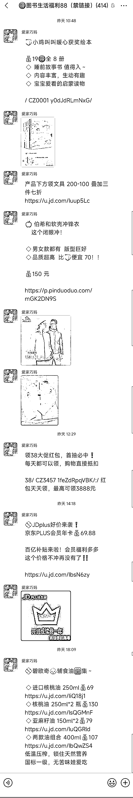

# 当当购书优惠码返利+社群

> 原文：[`www.yuque.com/for_lazy/xkrm14/slr7w0x8bogldhga`](https://www.yuque.com/for_lazy/xkrm14/slr7w0x8bogldhga)

作者： 月亮代表我的心 

日期：2023-03-08 

点赞数：15 

正文： 

当当购书优惠码返利+社群 起因： 38 节买书，因为经典书籍存在不同版本和翻译，精装，平装，收藏版，纪念版，周年版，彩绘版，双语版等，选择的时候搜索知乎上建议，从知乎一篇回答来到微博，发现简单的微博有令人吃惊的粉丝量。 内容： 微博内容非常简单且垂直，都是当当优惠码+TED/科普视频。 只做当当优惠券码，近 30 天发布 528 篇微博。 观察： 1.微博粉丝量大，156.9 万。 2.微博群聊成员 934/1000 接近满员。 3.做了当当图书优惠码的超话，留下 300 减 100 大额券的钩子，放微信号。 4.微信图书群，在里面发优惠券和购买的返利链接，不仅仅是图书，也不限于当当，京东，拼多多。看序号是 88 群，那么接近 4 万的微信私域？ 5.近期 38 节发博更频繁，3 月 7 日发博 62 篇，阅读 1 万，互动 15。 感觉模仿难度不高，欢迎讨论。 

  

  

  

  

  

  

评论区： 

暂无评论 

