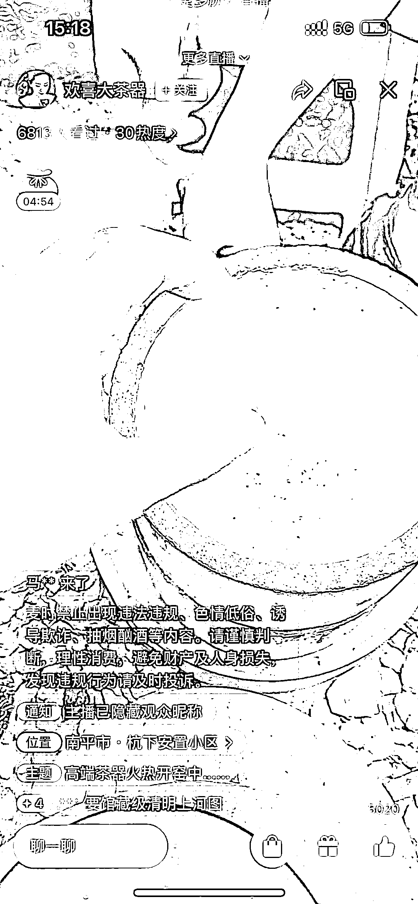
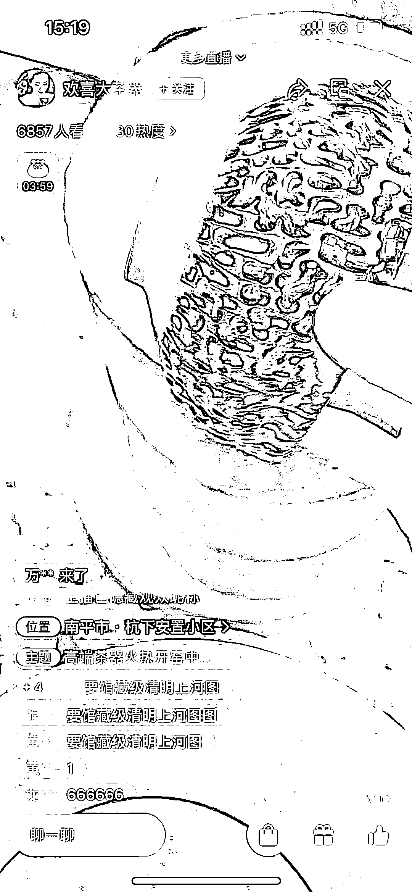
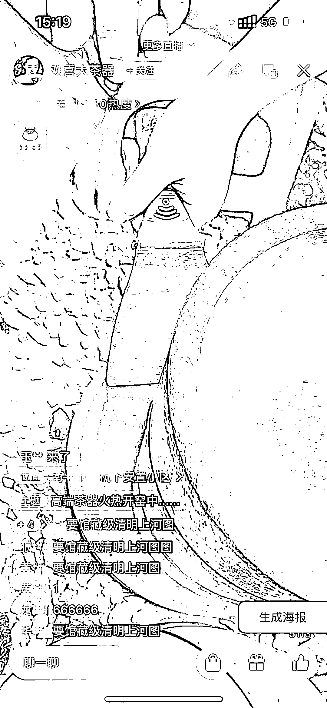

# 视频号陶瓷账号直播模拟开窑，可矩阵化操作

> 原文：[`www.yuque.com/for_lazy/xkrm14/wntwmnvr9vidym6f`](https://www.yuque.com/for_lazy/xkrm14/wntwmnvr9vidym6f)

作者： 马克图布 

日期：2023-03-10 

点赞数：40 

正文： 

视频号陶瓷账号直播清一色玩法，模拟开窑。全都是把杯子一个个藏起来，用敲的方式砸出来，有种新鲜感，停留特别长。我看到定位，好多都是一个地方的，感觉像是批量做的直播间。浏览量都特别高，很多账号甚至不发视频直接播。 

 

 

 

 

 

 

评论区： 

辉哥 : 我也刷到了，很多账号在直播，杯子在拼多多上面搜了一下，差不多价格翻倍 

李泊 : 我在抖音上买了 3 个 

波叔 : 是不是做的半无人直播？ 

高杰 : 这个应该不是无人直播，只是不露脸而已 

波叔 : 嗯呐 

