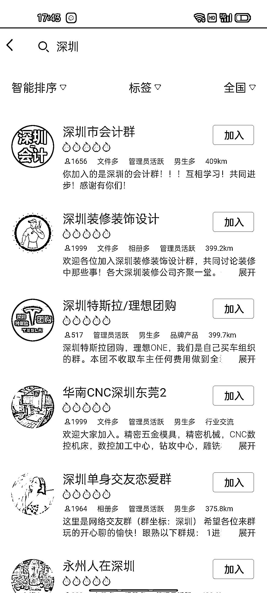
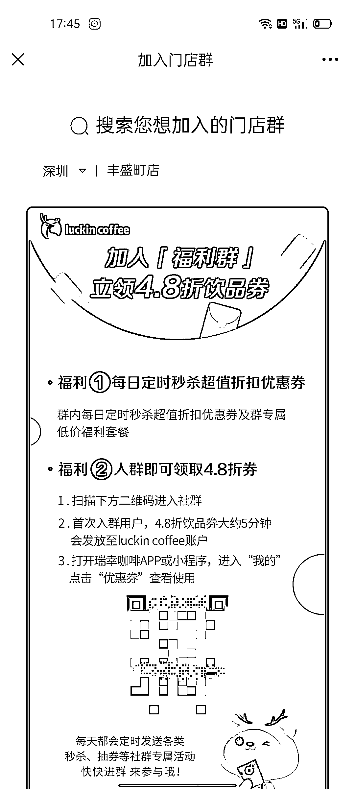
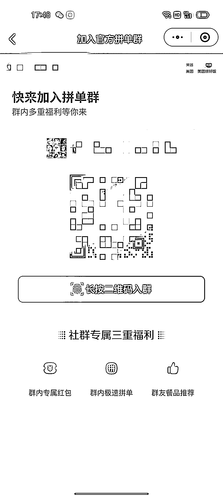
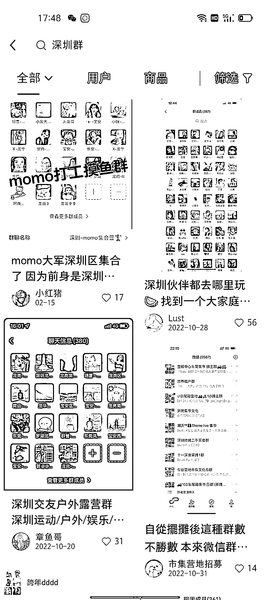

# 加入本地同城群的几个方法

> 原文：[`www.yuque.com/for_lazy/xkrm14/wvl3cbkp2ggv0z9h`](https://www.yuque.com/for_lazy/xkrm14/wvl3cbkp2ggv0z9h)

作者： 明月几时有 

日期：2023-03-06 

点赞数：36 

正文： 

加入本地同城群的几个方法 1.QQ 定位自己城市搜加群会出现很多 2.公众号关注瑞幸咖啡点菜单会出现入群的入口，改定位会有其他群 3.小程序美团拼好饭，点击我的页面加入官方拼单群，改定位会有其他群 4.饿了么和美团一样的方法 5.小红书定位自己的城市加搜自己想要的群聊。 

 

  

  

 

评论区： 

暂无评论 

