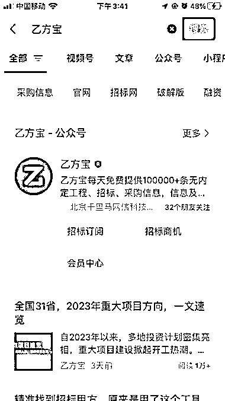
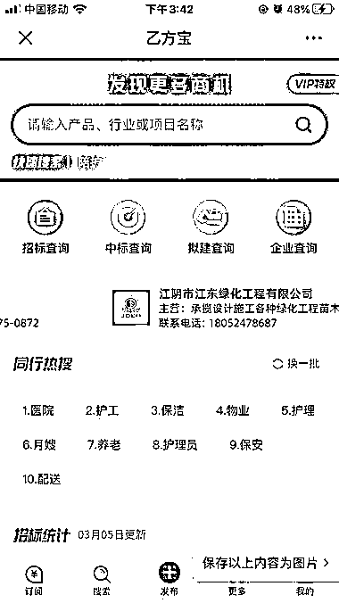

# 乙方宝，专业招标信息公众号

> 原文：[`www.yuque.com/for_lazy/xkrm14/dogn9wm8bab2oa71`](https://www.yuque.com/for_lazy/xkrm14/dogn9wm8bab2oa71)

作者： 星辰 

日期：2023-03-06 

点赞数：20 

正文： 

推荐一个比较不错的公众号：乙方宝。 里面有非常多的招标项目，各种类型都有，有政府部门的，也有医院的，企事业单位的等等。还可以搜索，可以订阅。 如果觉得项目不错，可以买个招标文件回来研究，然后投标。 因为我以前自己写过标书投标，所以对这行比较了解。一个招标文件有时候买来才 500，然后做个标书，便宜的几百，贵的几千。但是一个投标成功，可能就是几十万到上千万的项目。标书如果不会做，去某宝找人就行，但材料要自己提供。 

  

  

  

评论区： 

Caleb : [偷笑] 

时光 : 😂观察点他里面的资讯还可以，投就是炮灰了😂 

星辰 : 是么，不过我们这两年投中了五六个项目了，都是上面看到的呢。 

