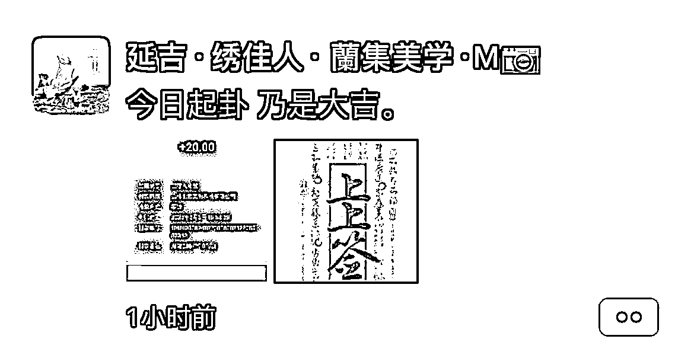

# 利用 Ai 绘图&Ghat GPT 做「私人定制符壁纸」

> 原文：[`www.yuque.com/for_lazy/xkrm14/mvtvpg4guiend8hy`](https://www.yuque.com/for_lazy/xkrm14/mvtvpg4guiend8hy)

<ne-p id="ubdcdb37e" data-lake-id="ubdcdb37e"><ne-text id="u776607a6">作者： 员外</ne-text></ne-p> <ne-p id="ue7e434f5" data-lake-id="ue7e434f5"><ne-text id="u6633173b">日期：2023-03-02</ne-text></ne-p> <ne-p id="u326ab55c" data-lake-id="u326ab55c"><ne-text id="ua4aff407">点赞数：</ne-text><ne-text id="u91e8e943" ne-bold="true">60</ne-text></ne-p> <ne-hole id="u192ed727" data-lake-id="u192ed727"><ne-card data-card-name="hr" data-card-type="block" id="w3lZC" data-event-boundary="card"><ne-p id="u1c5547d3" data-lake-id="u1c5547d3"><ne-text id="u215d4e75">正文：</ne-text></ne-p> <ne-p id="uc3127395" data-lake-id="uc3127395"><ne-text id="ud26c1937">刚刚在朋友圈看到一张图，一下有了一个想法💡忍不住想要发个风向标 想法💡：利用 Ai 绘图&Ghat; GPT 做「私人定制符壁纸」</ne-text> <ne-text id="uc9ca38f7">本次航海我报名了“AI 绘图&chat;</ne-text> <ne-text id="u7543e088">gpt”+“朋友圈运营”+“抖音图文”今天是开船仪式，刚刚我就在想抖音图文做点什么呢，还没思考太多，日常刷朋友圈看到了这个图，一下有了一个有意思的玩法，分享一下</ne-text> <ne-text id="u19d8b8d7">不知道能不能玩起来 1.玩法：利用 AI 绘图和 Chat GPT 做私人定制符壁纸， 通过抖音图文和小红书引流</ne-text> <ne-text id="uebf3f526">2.展现形式：像同城图文相亲一样“聊天记录对话式求定制符壁纸（考试、升本、求职、相亲、找对象 定制符壁纸）” 3.交付：单价 9.9-19.9 元</ne-text> <ne-text id="u116dc463">“符”里面包含用户的生辰八字，做的好看一点（不迷信，娱乐为主） 再加上朋友圈运营，这一下航海的东西全用上了，之前小红书看到过有发符的</ne-text> <ne-text id="u477adf53">流量还挺好，初步有个想法 还不成熟，打算跟着航海试试 [呲牙]</ne-text></ne-p> <ne-p id="u43b8494a" data-lake-id="u43b8494a"><ne-card data-card-name="image" data-card-type="inline" id="lJVj6" data-event-boundary="card"></ne-card></ne-p> <ne-p id="u687bcc05" data-lake-id="u687bcc05"><ne-card data-card-name="image" data-card-type="inline" id="zdlwH" data-event-boundary="card"></ne-card></ne-p> <ne-hole id="u89395ca8" data-lake-id="u89395ca8"><ne-card data-card-name="hr" data-card-type="block" id="KE9uT" data-event-boundary="card"><ne-p id="u0bb74df6" data-lake-id="u0bb74df6"><ne-text id="ud915a90f">评论区：</ne-text></ne-p> <ne-p id="ue0a12338" data-lake-id="ue0a12338"><ne-text id="ue6fb9f44">赤橙黄绿青蓝紫那个白 : 同 ai 船友，想了解下船友开始做了没有</ne-text></ne-p> <ne-p id="u3730ebed" data-lake-id="u3730ebed"><ne-text id="ub80147b5">员外 : 还没，还没画明白[流泪]</ne-text></ne-p> <ne-p id="u79dc8c75" data-lake-id="u79dc8c75"><ne-text id="u6df55eb5">明月几时有 : 好想法，立马发个笔记试试流量</ne-text></ne-p> <ne-p id="u2b6518b8" data-lake-id="u2b6518b8"><ne-text id="u66de2bcc">员外 : 怎么样</ne-text></ne-p> <ne-p id="u484bc095" data-lake-id="u484bc095"><ne-text id="ucd301572">明月几时有 : 发了几百个小眼睛，还没赚到第一块钱[呲牙]</ne-text></ne-p> <ne-p id="ue8ed60f5" data-lake-id="ue8ed60f5"><ne-text id="u13cb9f9c">浅色海洋の鱼 : 🥺MJ 绘的还是 SD 绘的啊？AI 绘画小白刚入</ne-text></ne-p> <ne-hole id="u7972d648" data-lake-id="u7972d648"><ne-card data-card-name="hr" data-card-type="block" id="v3ltQ" data-event-boundary="card"><ne-p id="uf2f19b44" data-lake-id="uf2f19b44"><ne-text id="u6de08e85">公众号懒人找资源，懒人专属群分享</ne-text></ne-p></ne-card></ne-hole></ne-card></ne-hole></ne-card></ne-hole>