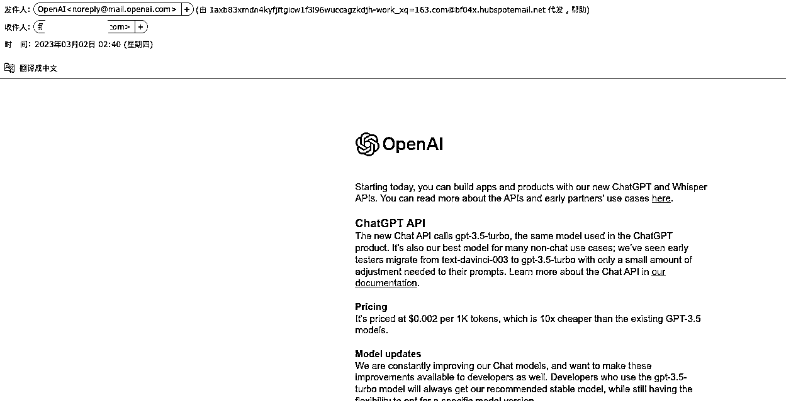
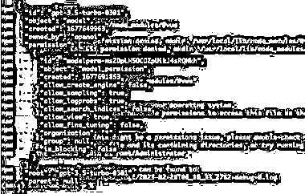

# ChatGPT3.5 API 模型开放

> 原文：[`www.yuque.com/for_lazy/xkrm14/becmcpkma5icfot8`](https://www.yuque.com/for_lazy/xkrm14/becmcpkma5icfot8)

<ne-p id="u718a35f1" data-lake-id="u718a35f1"><ne-text id="ub9488c99">作者： 徐同学</ne-text></ne-p> <ne-p id="u28c87ffd" data-lake-id="u28c87ffd"><ne-text id="u44a38065">日期：2023-03-02</ne-text></ne-p> <ne-p id="u1aea9202" data-lake-id="u1aea9202"><ne-text id="u95cdc64e">点赞数：</ne-text><ne-text id="uebc0409c" ne-bold="true">22</ne-text></ne-p> <ne-hole id="u46dfb287" data-lake-id="u46dfb287"><ne-card data-card-name="hr" data-card-type="block" id="fFoSX" data-event-boundary="card"><ne-p id="ub70bceae" data-lake-id="ub70bceae"><ne-text id="u18ac9edf">正文：</ne-text></ne-p> <ne-p id="u0c6ac35a" data-lake-id="u0c6ac35a"><ne-text id="uc2b67164">早上起来，看到有的群说 ChatGPT3.5 模型的开放了，去邮箱看了一下，确实收到之前申请之后的通知。 1\. 3.5 API</ne-text> <ne-text id="uda15c858">目前还是测试版本，到四月份会推出正式版本。 2\. 3.5 API($0.002/1k token)会比之前的 GPT3 的达芬奇($0.02/1k</ne-text> <ne-text id="u49f9ed18">token) api 便宜 10 倍。 3.提到了新的 Whisper 模型，主要处理语音转文本模型，没细看。 4.用 curl 测了一下，确实 apikey</ne-text> <ne-text id="u18e6f3eb">可以使用 gpt-3.5-turbo-0301。</ne-text></ne-p> <ne-p id="u74b8debf" data-lake-id="u74b8debf"><ne-card data-card-name="image" data-card-type="inline" id="xW2JA" data-event-boundary="card">  <ne-p id="u0ff28fcf" data-lake-id="u0ff28fcf"><ne-card data-card-name="image" data-card-type="inline" id="wFSN3" data-event-boundary="card">  <ne-p id="u8fe3343b" data-lake-id="u8fe3343b"><ne-card data-card-name="image" data-card-type="inline" id="WrHjw" data-event-boundary="card">  <ne-p id="u8924fb81" data-lake-id="u8924fb81"><ne-card data-card-name="image" data-card-type="inline" id="KdAHn" data-event-boundary="card">  <ne-p id="u0f2ee784" data-lake-id="u0f2ee784"><ne-card data-card-name="image" data-card-type="inline" id="oq5SG" data-event-boundary="card">  <ne-p id="uc5fc027c" data-lake-id="uc5fc027c"><ne-card data-card-name="image" data-card-type="inline" id="FGVQ6" data-event-boundary="card">  <ne-hole id="u75d42652" data-lake-id="u75d42652"><ne-card data-card-name="hr" data-card-type="block" id="cViCv" data-event-boundary="card"><ne-p id="u36bbf581" data-lake-id="u36bbf581"><ne-text id="ua4f2a4da">评论区：</ne-text></ne-p> <ne-p id="uafa06a76" data-lake-id="uafa06a76"><ne-text id="u8f4763a6">暂无评论</ne-text></ne-p> <ne-hole id="u979ee603" data-lake-id="u979ee603"><ne-card data-card-name="hr" data-card-type="block" id="S3up3" data-event-boundary="card"><ne-p id="u53e897b9" data-lake-id="u53e897b9"><ne-text id="ub4449954">公众号懒人找资源，懒人专属群分享</ne-text></ne-p></ne-card></ne-hole></ne-card></ne-hole></ne-card></ne-p></ne-card></ne-p></ne-card></ne-p></ne-card></ne-p></ne-card></ne-p></ne-card></ne-p></ne-card></ne-hole>