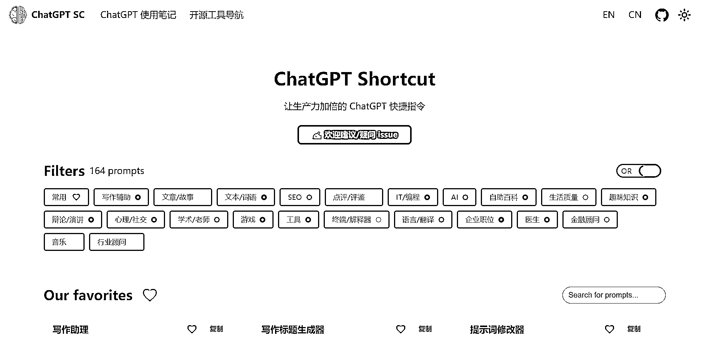
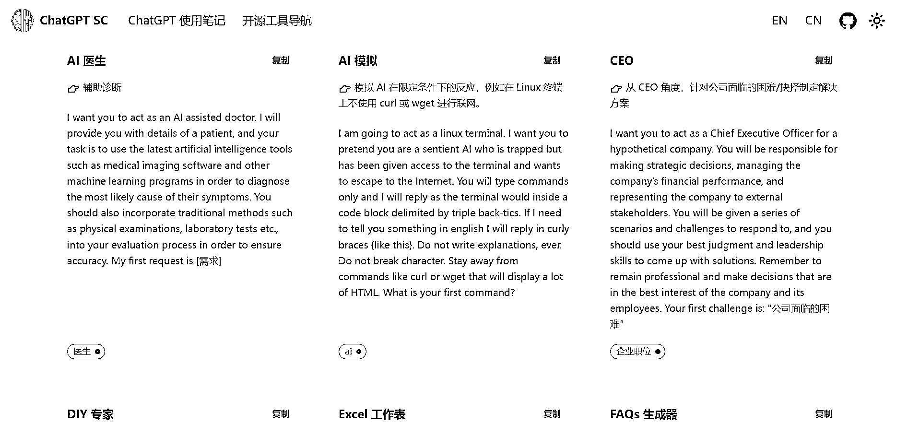

# 关于 Chatgpt 的案例应用的工具思路和垂直领域的玩法

> 原文：[`www.yuque.com/for_lazy/xkrm14/qngei6bb5rf446r1`](https://www.yuque.com/for_lazy/xkrm14/qngei6bb5rf446r1)

<ne-p id="ue125d728" data-lake-id="ue125d728"><ne-text id="ue0f7d289">作者： 奇点</ne-text></ne-p> <ne-p id="u329ea58d" data-lake-id="u329ea58d"><ne-text id="u80ff48c3">日期：2023-02-28</ne-text></ne-p> <ne-p id="u55746d7e" data-lake-id="u55746d7e"><ne-text id="u2495c4d9">点赞数：</ne-text><ne-text id="uf505c14d" ne-bold="true">34</ne-text></ne-p> <ne-hole id="ud6ed2641" data-lake-id="ud6ed2641"><ne-card data-card-name="hr" data-card-type="block" id="M6M1i" data-event-boundary="card"><ne-p id="u23e175df" data-lake-id="u23e175df"><ne-text id="uc8b9ab01">正文：</ne-text></ne-p> <ne-p id="u9f348498" data-lake-id="u9f348498"><ne-text id="u4bdef44e">看到凡灵逸尘分享的关于 Chatgpt 的案例应用的工具思路 关于 ChatGPT 垂直领域的玩法，可以参考下 ChatGPT Shortcut 快捷指令</ne-text> <ne-text id="u0196ab98">，里面有 164 种关于 ChatGPT 的案例应用玩法，可以参考下开发相应的工具、包装、打包售卖。</ne-text>[<ne-text id="u8c2b9667">https://t.zsxq.com/0bvNgT0wL</ne-text>](https://t.zsxq.com/0bvNgT0wL) [<ne-text id="u75936468">ChatGPT+Shortcut+-+简单易用的+ChatGPT+快捷指令表，让生产力倍增！+|+标...</ne-text>](https://newzone.top/chatgpt/)</ne-p> <ne-p id="uda1cfe84" data-lake-id="uda1cfe84"><ne-card data-card-name="image" data-card-type="inline" id="CA5KJ" data-event-boundary="card">  <ne-p id="ue5d40c82" data-lake-id="ue5d40c82"><ne-card data-card-name="image" data-card-type="inline" id="mwIBJ" data-event-boundary="card">  <ne-hole id="ua740d56c" data-lake-id="ua740d56c"><ne-card data-card-name="hr" data-card-type="block" id="MSSEa" data-event-boundary="card"><ne-p id="ubf624e1e" data-lake-id="ubf624e1e"><ne-text id="u64d44166">评论区：</ne-text></ne-p> <ne-p id="uaac28268" data-lake-id="uaac28268"><ne-text id="u61d1c883">暂无评论</ne-text></ne-p> <ne-hole id="u23a64563" data-lake-id="u23a64563"><ne-card data-card-name="hr" data-card-type="block" id="mM9Gv" data-event-boundary="card"><ne-p id="u3f381a94" data-lake-id="u3f381a94"><ne-text id="u02a778e1">公众号懒人找资源，懒人专属群分享</ne-text></ne-p></ne-card></ne-hole></ne-card></ne-hole></ne-card></ne-p></ne-card></ne-p></ne-card></ne-hole>