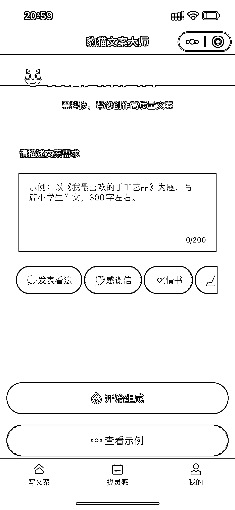

# 关于 Chatgpt 的案例应用

> 原文：[`www.yuque.com/for_lazy/xkrm14/cwgfshnop33d51im`](https://www.yuque.com/for_lazy/xkrm14/cwgfshnop33d51im)

作者： 凡灵逸尘 

日期：2023-02-27 

点赞数：31 

正文： 

写一个关于 Chatgpt 的案例应用，从而发散大家的思维。 刘小排老师之前基于 Chatgpt 开发一个专业写文案的小程序，当时我只意识到这个工具的运用。 今天和朋友聊天，他近期用 Chatgpt 测试很多垂直领域的玩法，共计一百九十多种花了四天多时间。 就是利用 Chatgpt 开发一些相应的工具，从而对工具进行包装，然后售卖给有需求的人。 很多人不了解 Chatgpt 没有关系，但他们一定会对一些工具有相应的需求。 比如用它来写直播话术，制作一个专业写话术的工具，去卖给做直播的同行等。 

 

评论区： 

亦仁 : 哪 190 多种，快整理到星球来拿个精华 

