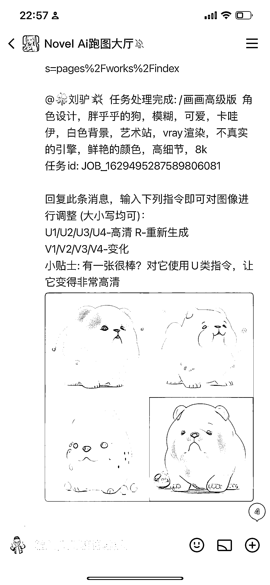
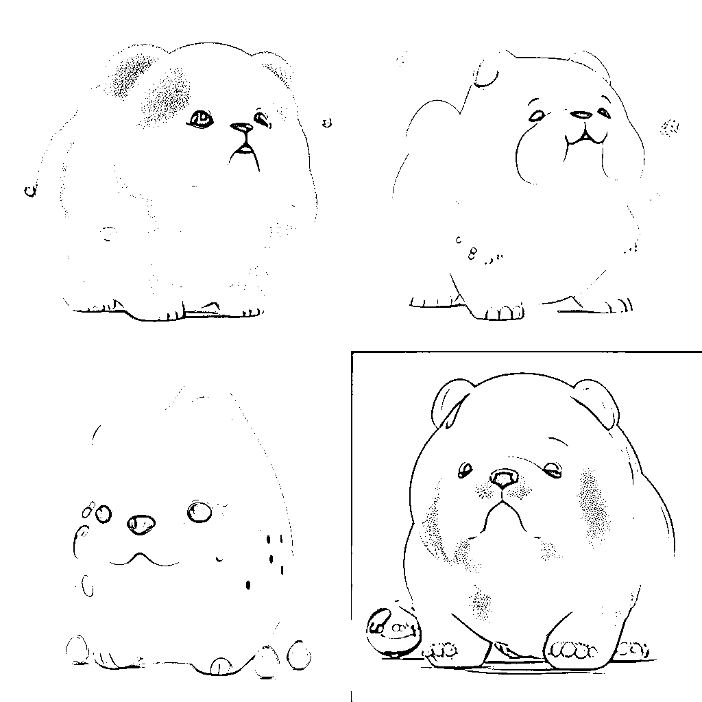
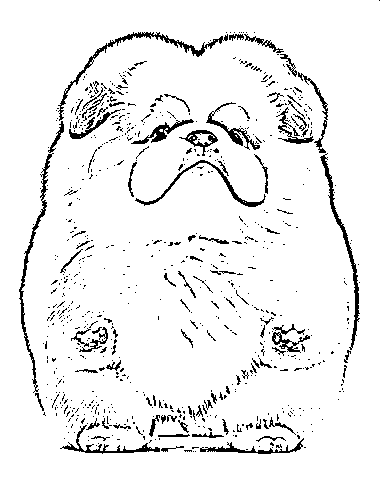
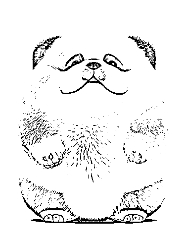

# 国内开发出图工具，通过自媒体平台引流到公众号

> 原文：[`www.yuque.com/for_lazy/xkrm14/ptdv4f52ki1v5hrf`](https://www.yuque.com/for_lazy/xkrm14/ptdv4f52ki1v5hrf)

<ne-p id="ua91f1119" data-lake-id="ua91f1119"><ne-text id="u7465f90f">作者： 🍀刘驴💥</ne-text></ne-p> <ne-p id="uba3730f2" data-lake-id="uba3730f2"><ne-text id="ued7fe398">日期：2023-02-27</ne-text></ne-p> <ne-p id="ud9327a27" data-lake-id="ud9327a27"><ne-text id="u9c8a816e">点赞数：</ne-text><ne-text id="ucec5f861" ne-bold="true">32</ne-text></ne-p> <ne-hole id="ub680c3b0" data-lake-id="ub680c3b0"><ne-card data-card-name="hr" data-card-type="block" id="W4QwD" data-event-boundary="card"><ne-p id="u27ecd711" data-lake-id="u27ecd711"><ne-text id="u64d7fdb1">正文：</ne-text></ne-p> <ne-p id="u15f542b9" data-lake-id="u15f542b9"><ne-text id="uef36a9dd">国内开发的，效果类似 Midjourney，前端靠抖音、视频号、快手等平台进行引流，引导进公众号里，公众号+QQ 频道，链路打通的很丝滑。</ne-text> <ne-text id="u450f2713">支持中文，出图速度很快，效果和 Midjourney 差不太多（图 4 还没深化），同样的描述词我在 Midjourney 试过，最后俩张图是 Midjourney 的效果图</ne-text></ne-p> <ne-p id="ua5da8cf5" data-lake-id="ua5da8cf5"><ne-card data-card-name="image" data-card-type="inline" id="i48f4" data-event-boundary="card"></ne-card></ne-p> <ne-p id="ueb961188" data-lake-id="ueb961188"><ne-card data-card-name="image" data-card-type="inline" id="OuMtf" data-event-boundary="card">  <ne-p id="ud679f69b" data-lake-id="ud679f69b"><ne-card data-card-name="image" data-card-type="inline" id="wKiUb" data-event-boundary="card">  <ne-p id="uda65f897" data-lake-id="uda65f897"><ne-card data-card-name="image" data-card-type="inline" id="Nia2W" data-event-boundary="card">  <ne-p id="u59b93376" data-lake-id="u59b93376"><ne-card data-card-name="image" data-card-type="inline" id="yQeVw" data-event-boundary="card">  <ne-p id="u66bb2594" data-lake-id="u66bb2594"><ne-card data-card-name="image" data-card-type="inline" id="IkF96" data-event-boundary="card">  <ne-hole id="u2ba87de7" data-lake-id="u2ba87de7"><ne-card data-card-name="hr" data-card-type="block" id="zdmwn" data-event-boundary="card"><ne-p id="udb59d575" data-lake-id="udb59d575"><ne-text id="u7b5cb9f6">评论区：</ne-text></ne-p> <ne-p id="ufbb269bc" data-lake-id="ufbb269bc"><ne-text id="u802d8e97">豆豆 : 这是什么应用呀</ne-text></ne-p> <ne-p id="u8171db13" data-lake-id="u8171db13"><ne-text id="u765e7bb0">🍀刘驴💥 : QQ 频道，你去搜索下就可以找到很多</ne-text></ne-p> <ne-hole id="u95f3d626" data-lake-id="u95f3d626"><ne-card data-card-name="hr" data-card-type="block" id="Q6nFW" data-event-boundary="card"><ne-p id="uaf72726d" data-lake-id="uaf72726d"><ne-text id="u94d0a8ca">公众号懒人找资源，懒人专属群分享</ne-text></ne-p></ne-card></ne-hole></ne-card></ne-hole></ne-card></ne-p></ne-card></ne-p></ne-card></ne-p></ne-card></ne-p></ne-card></ne-p></ne-card></ne-hole>