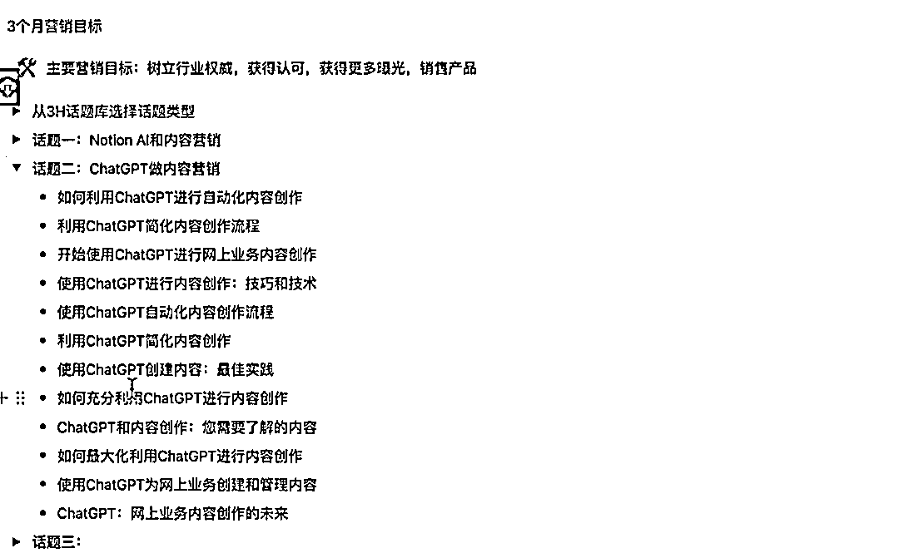

# Notion+ChatGPT，内容创造无限可能

> 原文：[`www.yuque.com/for_lazy/xkrm14/xnelteqiuwkycgq6`](https://www.yuque.com/for_lazy/xkrm14/xnelteqiuwkycgq6)

作者： 西成歌 

日期：2023-02-27 

点赞数：19 

正文： 

Notion+ChatGPT 内容创造无限可能 Notion 是一款将笔记、知识库和任务管理整合在一起的协作应用 通过 Notion 收集资料，整合后建立垂直行业知识库，由 Notion AI 总结概括，翻译成所需语言，随后用 ChatGPT 发散之前的框架，快速生产优质内容，每个领域都有无限可能 

  

  

  

评论区： 

暂无评论 

