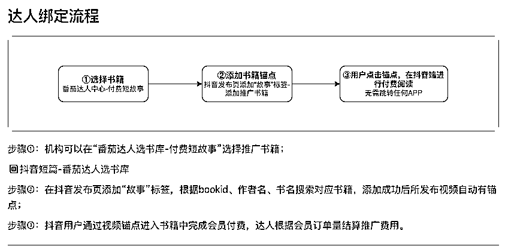
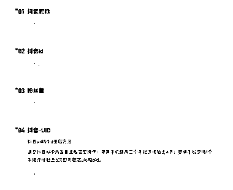

# 抖音开启描点故事，在平台内自建短篇小说，来拉升停留时间

> 原文：[`www.yuque.com/for_lazy/xkrm14/dovzqniugos67eaw`](https://www.yuque.com/for_lazy/xkrm14/dovzqniugos67eaw)

作者： 小马哥 xy50 

日期：2023-03-02 

点赞数：35 

正文： 

抖音开启描点故事，类似于知乎盐选一样，在平台内自建短篇小说，来拉升停留时间。 描点故事与知乎推文推广不同在于，直接是站内的，不需要进行搜索关键词，只需要将视频与故事关联起来即可，用户一点击就可以。 做过知乎推文或者其他渠道推文的，可以进行操作，一单 8 元。 

  

  

  

评论区： 

小马哥 xy50 : 需要对应的资料及申请表可以私我 

小马哥 xy50 : 需要操作的，可以找我领取权限申请表，把锚点故事权限开通，接下来会梳理操作流程，感兴趣的可以关注 

