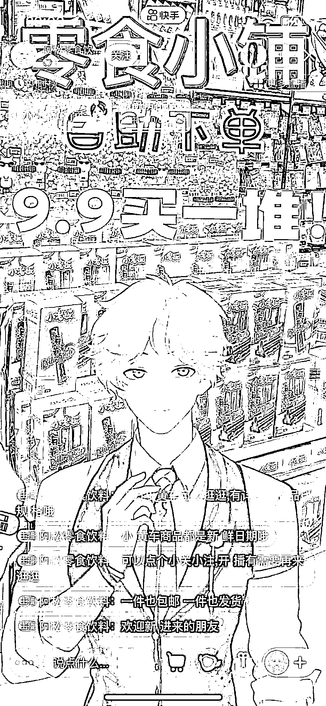

# 抖音搭建虚拟零食直播间

> 原文：[`www.yuque.com/for_lazy/xkrm14/ihkb83km0hbumas7`](https://www.yuque.com/for_lazy/xkrm14/ihkb83km0hbumas7)

<ne-p id="u4dfecaec" data-lake-id="u4dfecaec"><ne-text id="ufafcf8ee">作者： 小牛</ne-text></ne-p> <ne-p id="udfbeafcf" data-lake-id="udfbeafcf"><ne-text id="ubadd2094">日期：2023-02-28</ne-text></ne-p> <ne-p id="u9df94e2c" data-lake-id="u9df94e2c"><ne-text id="u9e19729d">点赞数：</ne-text><ne-text id="u9f793130" ne-bold="true">26</ne-text></ne-p> <ne-hole id="ue06dabd9" data-lake-id="ue06dabd9"><ne-card data-card-name="hr" data-card-type="block" id="sFE4O" data-event-boundary="card"><ne-p id="u57920220" data-lake-id="u57920220"><ne-text id="u62051fb7">正文：</ne-text></ne-p> <ne-p id="u16ebfc02" data-lake-id="u16ebfc02"><ne-text id="u40276ff1">最近看到不少搞虚拟零食直播间的，数据还可以。 这种虚拟卖零食，操作起来相对于实体来说简单多了。电脑+摄像头实时动捕！完全读话术平播。</ne-text> <ne-text id="ua0a51812">背景电商平台很多，虚拟人物也比较好解决，可以软件进行动捕。</ne-text></ne-p> <ne-p id="u952270f5" data-lake-id="u952270f5"><ne-card data-card-name="image" data-card-type="inline" id="yFNm8" data-event-boundary="card"></ne-card></ne-p> <ne-p id="u82ea1b31" data-lake-id="u82ea1b31"><ne-card data-card-name="image" data-card-type="inline" id="jjWuH" data-event-boundary="card"></ne-card></ne-p> <ne-hole id="u0e3a7a46" data-lake-id="u0e3a7a46"><ne-card data-card-name="hr" data-card-type="block" id="mej9u" data-event-boundary="card"><ne-p id="uee8171d2" data-lake-id="uee8171d2"><ne-text id="ubb004bab">评论区：</ne-text></ne-p> <ne-hole id="u516da0bf" data-lake-id="u516da0bf"><ne-card data-card-name="hr" data-card-type="block" id="BLDdL" data-event-boundary="card"><ne-p id="u9811141a" data-lake-id="u9811141a"><ne-text id="u54d42966">公众号懒人找资源，懒人专属群分享</ne-text></ne-p></ne-card></ne-hole></ne-card></ne-hole></ne-card></ne-hole>