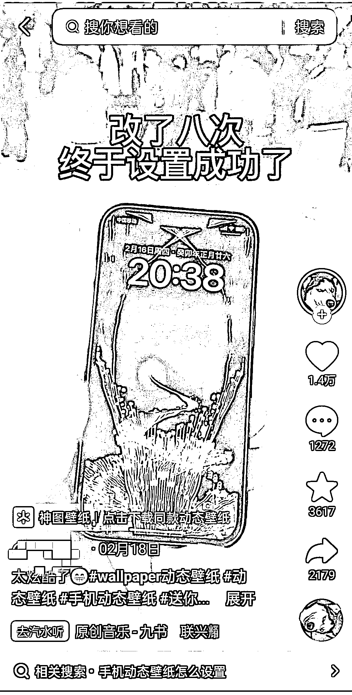

# 抖音展示精美视频做成手机屏保，挂载小程序，引导用户下载

> 原文：[`www.yuque.com/for_lazy/xkrm14/gsrqs76o4db4l9f5`](https://www.yuque.com/for_lazy/xkrm14/gsrqs76o4db4l9f5)

<ne-p id="u0a3b7510" data-lake-id="u0a3b7510"><ne-text id="ue1701fdd">作者： 徐 Ken</ne-text></ne-p> <ne-p id="u33ced258" data-lake-id="u33ced258"><ne-text id="u2ffa4194">日期：2023-02-28</ne-text></ne-p> <ne-p id="u9f012577" data-lake-id="u9f012577"><ne-text id="u1ad74147">点赞数：</ne-text><ne-text id="u54ea5ddd" ne-bold="true">15</ne-text></ne-p> <ne-hole id="u9adce747" data-lake-id="u9adce747"><ne-card data-card-name="hr" data-card-type="block" id="wB98T" data-event-boundary="card"><ne-p id="u14685cdb" data-lake-id="u14685cdb"><ne-text id="uc3cd3220">正文：</ne-text></ne-p> <ne-p id="u8c7eb5e6" data-lake-id="u8c7eb5e6"><ne-text id="uca79b856">展示精美视频做成的手机屏保，挂载小程序，引导用户下载，赚取广告收益。</ne-text></ne-p> <ne-p id="uae89b31c" data-lake-id="uae89b31c"><ne-card data-card-name="image" data-card-type="inline" id="IwUM5" data-event-boundary="card"></ne-card></ne-p> <ne-hole id="u2d1a22d2" data-lake-id="u2d1a22d2"><ne-card data-card-name="hr" data-card-type="block" id="C6xg6" data-event-boundary="card"><ne-p id="u84fb104f" data-lake-id="u84fb104f"><ne-text id="u153f39f8">评论区：</ne-text></ne-p> <ne-p id="ue07ffc95" data-lake-id="ue07ffc95"><ne-text id="u2cb113f6">暂无评论</ne-text></ne-p> <ne-hole id="u3e1a34a5" data-lake-id="u3e1a34a5"><ne-card data-card-name="hr" data-card-type="block" id="D0vs0" data-event-boundary="card"><ne-p id="u53c49e85" data-lake-id="u53c49e85"><ne-text id="ub81bd0e2">公众号懒人找资源，懒人专属群分享</ne-text></ne-p></ne-card></ne-hole></ne-card></ne-hole></ne-card></ne-hole>