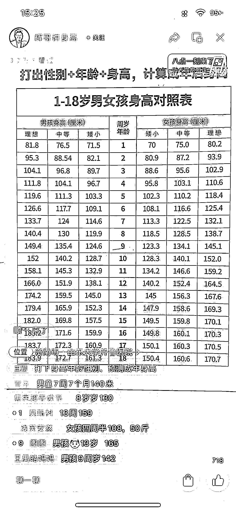

# 抖音讲儿童身高账号，粉丝下单速度快

> 原文：[`www.yuque.com/for_lazy/xkrm14/ho9od8vai1rct27b`](https://www.yuque.com/for_lazy/xkrm14/ho9od8vai1rct27b)

<ne-p id="u239541cf" data-lake-id="u239541cf"><ne-text id="u1382f74f">作者： 星星</ne-text></ne-p> <ne-p id="u7ab815d3" data-lake-id="u7ab815d3"><ne-text id="u7e1ab6c8">日期：2023-02-28</ne-text></ne-p> <ne-p id="ud9ded463" data-lake-id="ud9ded463"><ne-text id="u39abdb79">点赞数：</ne-text><ne-text id="uc1a69c70" ne-bold="true">35</ne-text></ne-p> <ne-hole id="ua269066d" data-lake-id="ua269066d"><ne-card data-card-name="hr" data-card-type="block" id="RuXxM" data-event-boundary="card"><ne-p id="u48da718a" data-lake-id="u48da718a"><ne-text id="ua075bea0">正文：</ne-text></ne-p> <ne-p id="u6098d2f3" data-lake-id="u6098d2f3"><ne-text id="ufd42b806">只有你想不到，没有他们做不到，这样简单的方式，去卖书，出单特别快，只要和孩子相关的，下单速度真的超级快~</ne-text></ne-p> <ne-p id="u6ff5125f" data-lake-id="u6ff5125f"><ne-card data-card-name="image" data-card-type="inline" id="cMemz" data-event-boundary="card"></ne-card></ne-p> <ne-p id="udc3bbf0f" data-lake-id="udc3bbf0f"><ne-card data-card-name="image" data-card-type="inline" id="bcYg5" data-event-boundary="card">  <ne-hole id="u41ebce57" data-lake-id="u41ebce57"><ne-card data-card-name="hr" data-card-type="block" id="Jj5gX" data-event-boundary="card"><ne-p id="u319af850" data-lake-id="u319af850"><ne-text id="u37a958a0">评论区：</ne-text></ne-p> <ne-p id="u151eacf1" data-lake-id="u151eacf1"><ne-text id="ua8d15f92">白奇杉 : 我也刷到了</ne-text></ne-p> <ne-p id="u685e1c53" data-lake-id="u685e1c53"><ne-text id="u8ffe8da3">星星 : [握手][握手][握手][握手]</ne-text></ne-p> <ne-p id="ud72bd7a9" data-lake-id="ud72bd7a9"><ne-text id="ue43372a7">奇颖 sophia : 卖书利润应该薄吧，其实这里可以卖别的，可以涨身高的保健品什么的都可以卖吧。</ne-text></ne-p> <ne-hole id="u4f8e0be1" data-lake-id="u4f8e0be1"><ne-card data-card-name="hr" data-card-type="block" id="CiWhJ" data-event-boundary="card"><ne-p id="u160e2776" data-lake-id="u160e2776"><ne-text id="u1ba49508">公众号懒人找资源，懒人专属群分享</ne-text></ne-p></ne-card></ne-hole></ne-card></ne-hole></ne-card></ne-p></ne-card></ne-hole>