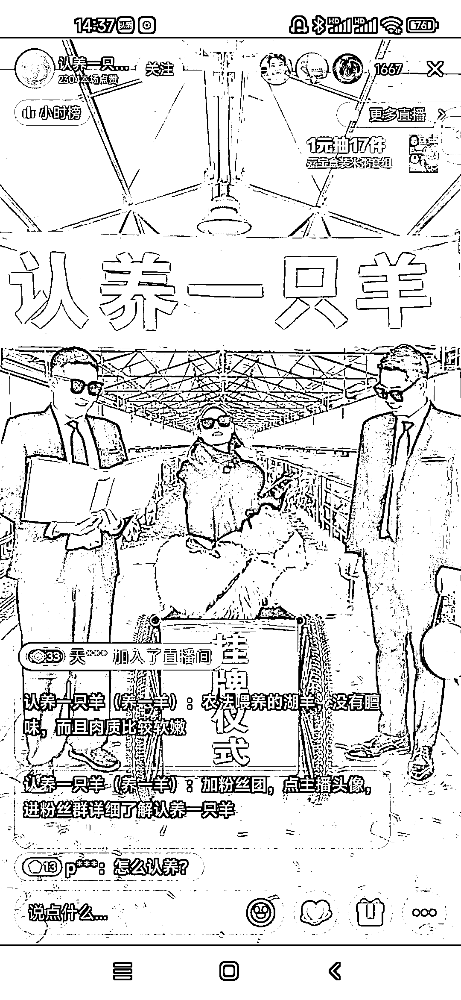
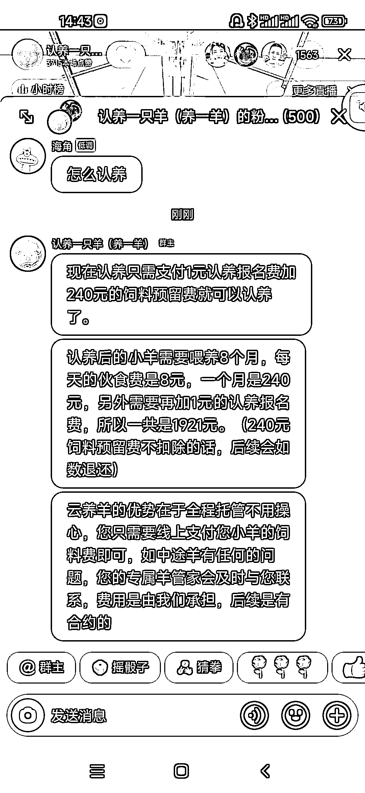

# 抖音云养羊直播间，粉丝可以认养一头羊

> 原文：[`www.yuque.com/for_lazy/xkrm14/bmlfxg3v6bt7t7s3`](https://www.yuque.com/for_lazy/xkrm14/bmlfxg3v6bt7t7s3)

作者： 向上生长 

日期：2023-02-28 

点赞数：21 

正文： 

认养一头羊的直播间，看了十多分钟，搞懂了大概的模式。付费买一只小羊，可以自己指定名字，农场给喂养 8 个月，24 小时可以溯源监控，养大了随时可以屠宰。收费方式如截图所示了。 精髓：情感攻势，给老人的健康羊肉，给兄弟姐妹吹牛逼，过年了吃烤全羊。 拓展：云养鸡、云养鹅、云养猪、云养骆驼等等。 

 

 

 

 

评论区： 

陈真 : 养了个羊？ 

💪🏻吉吉积极向上 : 这个绝了 

海鸟 : 灵感来自“羊了个羊”，还是“阳了个阳”？ 

