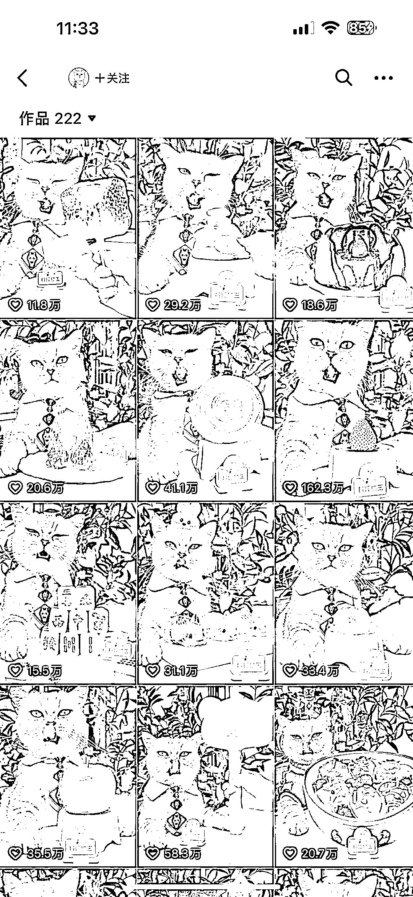
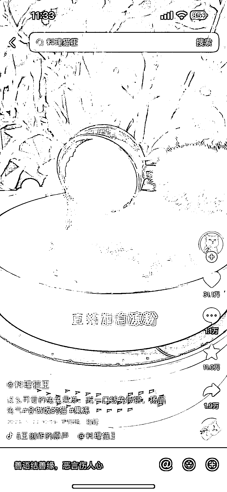

# 短视频通过道具，错位视角，拍摄猫做饭的过程，收获千万粉丝

> 原文：[`www.yuque.com/for_lazy/xkrm14/gi9yy8cmyd86pqr5`](https://www.yuque.com/for_lazy/xkrm14/gi9yy8cmyd86pqr5)

<ne-p id="u7db8e52d" data-lake-id="u7db8e52d"><ne-text id="u4d2d3157">作者： 斑马森林</ne-text></ne-p> <ne-p id="u9bafd504" data-lake-id="u9bafd504"><ne-text id="uc83823ec">日期：2023-02-28</ne-text></ne-p> <ne-p id="u3fb9e3ae" data-lake-id="u3fb9e3ae"><ne-text id="u802b517d">点赞数：</ne-text><ne-text id="ua0fc0b21" ne-bold="true">21</ne-text></ne-p> <ne-hole id="uf7ef9b23" data-lake-id="uf7ef9b23"><ne-card data-card-name="hr" data-card-type="block" id="hbFtO" data-event-boundary="card"><ne-p id="u61d0f6b0" data-lake-id="u61d0f6b0"><ne-text id="uf361015f">正文：</ne-text></ne-p> <ne-p id="u766b8bf4" data-lake-id="u766b8bf4"><ne-text id="u6dda5adc">国内短视频平台的料理猫王，全网粉丝累计千万，一只“会做饭”的猫，通过道具，错位视角，拍摄猫做饭的过程。</ne-text> <ne-text id="u2e6e1a10">萌宠天然具备吸粉能力，何况是具备了“人的行为”的宠物呢。</ne-text> <ne-text id="u2b8c8d57">有圈友前期通过搬运该账号到 TikTok 上，后期转原创，已在 TikTok 和 YouTube 上收获千万粉丝。 变现方式主要是带货和广告</ne-text></ne-p> <ne-p id="u95d941bf" data-lake-id="u95d941bf"><ne-card data-card-name="image" data-card-type="inline" id="xwZza" data-event-boundary="card"></ne-card></ne-p> <ne-p id="ubd60b79a" data-lake-id="ubd60b79a"><ne-card data-card-name="image" data-card-type="inline" id="KrkOp" data-event-boundary="card"></ne-card></ne-p> <ne-hole id="udbf8b89f" data-lake-id="udbf8b89f"><ne-card data-card-name="hr" data-card-type="block" id="NFB3t" data-event-boundary="card"><ne-p id="u2e28ce5f" data-lake-id="u2e28ce5f"><ne-text id="u825b08e9">评论区：</ne-text></ne-p> <ne-p id="u92b9b4ea" data-lake-id="u92b9b4ea"><ne-text id="ue83557fe">暂无评论</ne-text></ne-p> <ne-hole id="ub6518d91" data-lake-id="ub6518d91"><ne-card data-card-name="hr" data-card-type="block" id="SdxgJ" data-event-boundary="card"><ne-p id="ud31a0957" data-lake-id="ud31a0957"><ne-text id="ubb9fb940">公众号懒人找资源，懒人专属群分享</ne-text></ne-p></ne-card></ne-hole></ne-card></ne-hole></ne-card></ne-hole>