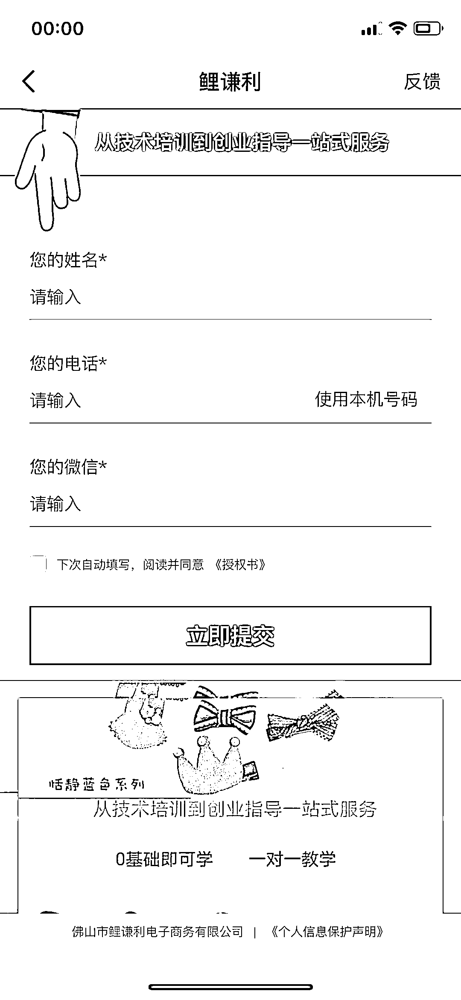

# 发夹制作培训，广告投放引流

> 原文：[`www.yuque.com/for_lazy/xkrm14/xixii87hgdgyiwgf`](https://www.yuque.com/for_lazy/xkrm14/xixii87hgdgyiwgf)

<ne-p id="u9e026b84" data-lake-id="u9e026b84"><ne-text id="uad480f72">作者： 时代</ne-text></ne-p> <ne-p id="u3fdcd056" data-lake-id="u3fdcd056"><ne-text id="uac476e49">日期：2023-02-27</ne-text></ne-p> <ne-p id="u761ac034" data-lake-id="u761ac034"><ne-text id="u9f5e94f2">点赞数：</ne-text><ne-text id="u1420733f" ne-bold="true">9</ne-text></ne-p> <ne-hole id="uf62e84c4" data-lake-id="uf62e84c4"><ne-card data-card-name="hr" data-card-type="block" id="zccMu" data-event-boundary="card"><ne-p id="u52966e64" data-lake-id="u52966e64"><ne-text id="u9c98608b">正文：</ne-text></ne-p> <ne-p id="u8828c04b" data-lake-id="u8828c04b"><ne-text id="u4b08af74">发夹制作培训 广告投放 目前就业环境，应该有大批宝妈等用户寻找副业、兼职等补贴家用等。</ne-text> <ne-text id="u0c5f4e21">这种培训，从兼职到创业，也可以延伸到其他行业是否可以做培训的广告投放。只要利润空间足够大，就有机会用广告的模式去引流转化。</ne-text></ne-p> <ne-p id="u0fd67fc5" data-lake-id="u0fd67fc5"><ne-card data-card-name="image" data-card-type="inline" id="hwxDd" data-event-boundary="card">  <ne-p id="u5c2470ff" data-lake-id="u5c2470ff"><ne-card data-card-name="image" data-card-type="inline" id="fxhiN" data-event-boundary="card">  <ne-p id="u5e7fd330" data-lake-id="u5e7fd330"><ne-card data-card-name="image" data-card-type="inline" id="UMjGo" data-event-boundary="card">  <ne-hole id="u4a303acc" data-lake-id="u4a303acc"><ne-card data-card-name="hr" data-card-type="block" id="KziN4" data-event-boundary="card"><ne-p id="udb7c05e7" data-lake-id="udb7c05e7"><ne-text id="u0f0b8382">评论区：</ne-text></ne-p> <ne-p id="u48d20742" data-lake-id="u48d20742"><ne-text id="uf296226c">暂无评论</ne-text></ne-p> <ne-hole id="u4a881934" data-lake-id="u4a881934"><ne-card data-card-name="hr" data-card-type="block" id="UpObi" data-event-boundary="card"><ne-p id="ub3b7b767" data-lake-id="ub3b7b767"><ne-text id="ue11a2bb7">公众号懒人找资源，懒人专属群分享</ne-text></ne-p></ne-card></ne-hole></ne-card></ne-hole></ne-card></ne-p></ne-card></ne-p></ne-card></ne-p></ne-card></ne-hole>