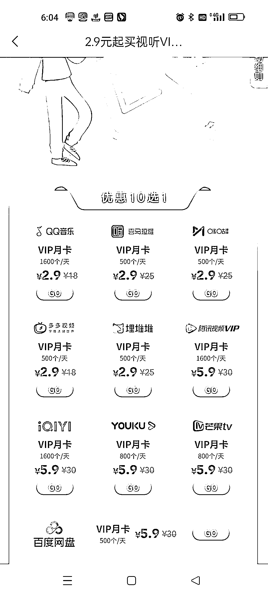
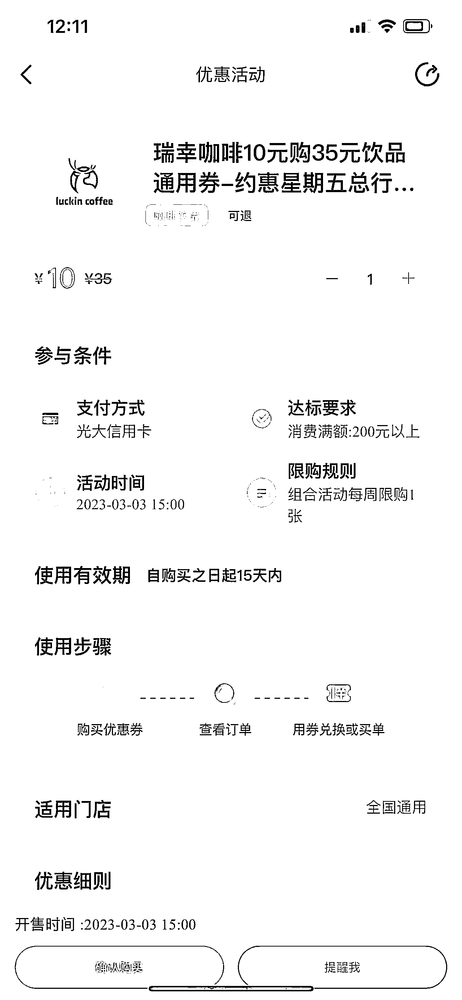

# 银行的生活权益 ，可在闲鱼等其他平台赚差价

> 原文：[`www.yuque.com/for_lazy/xkrm14/dkguffc7spy0k7gv`](https://www.yuque.com/for_lazy/xkrm14/dkguffc7spy0k7gv)

作者： 小怪兽 

日期：2023-03-02 

点赞数：36 

正文： 

每个银行每个月都有生活权益 小红书咸鱼知乎抖音公众号，都有人在收权益 举个例子瑞幸咖啡 29 元兑换券 市场收购价格从 10-12.5 不等，对于小白来说，卖掉有利润就行 我一个朋友卖洗车券，每个月能收大概 1000 张左右，他每张赚 2 块钱，开始供给黄牛，现在开始自己供给门店 赚差价的同时，不断的积累自己同城流量资源 

  

  

  

评论区： 

三生 : 电影票、会员都是这种 

小怪兽 : 嗯，电影票还可以囤券 

郑经 : 是的，我之前收了几千张瑞幸[呲牙] 

方块九 : 怎么卖的？ 

郑经 : 32 的卖 15 左右 

方块九 : 厉害 有流量都能卖 

月亮代表我的心 : 中信银行 9 分享兑和工商银行 8.8 元月卡用了好多年，但是没想到去批量化操作赚差价和引流，思路点赞[强] 

+龙 : 洗车券怎么收的，我有 10 几个车友群 

