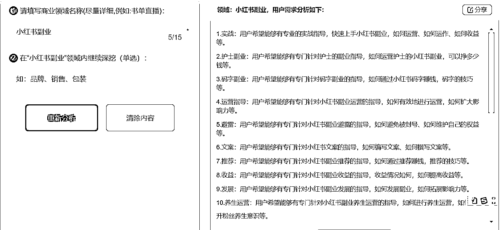
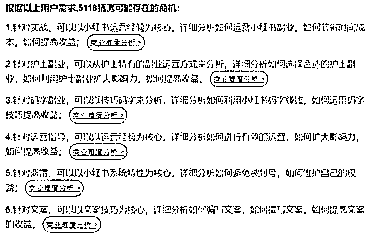

# 五千一百一十八、商机淘金助手，能够进一步挖掘需求

> 原文：[`www.yuque.com/for_lazy/xkrm14/ykud18gmx8v71vx6`](https://www.yuque.com/for_lazy/xkrm14/ykud18gmx8v71vx6)

作者： 蓝弈 

日期：2023-03-01 

点赞数：88 

正文： 

5118 商机淘金助手 看到有意思的风向标可以放入中进一步的挖掘需求，提高对风向标的理解能力，提高中标率，可以知道从哪方面下场实战。 

  

  

  

评论区： 

胡天天 : 不得不说一句，牛逼！ 

晴天 : 麻烦问下，这个是网页还是啥呢？没有搜到呢 

蓝弈 : 网页，5118 网站下的一个功能：[商机淘金助手+-+利用海量大数据挖掘潜在商机，解锁无限商业灵感！](https://www.5118.com/niche) 

施霖终生学习者-链接 : 这个很溜， 

