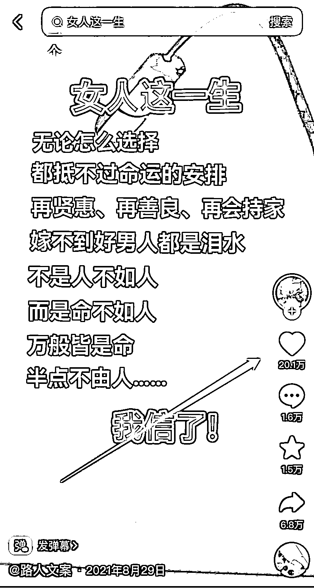
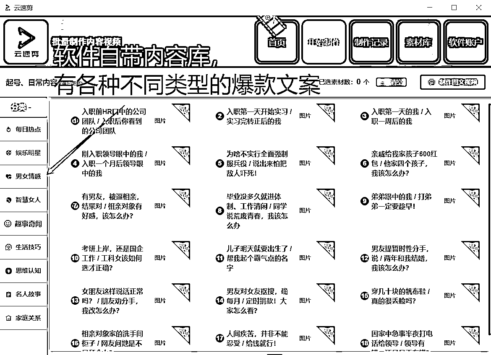

# 短视频批量快速生成工具

> 原文：[`www.yuque.com/for_lazy/xkrm14/dsieul3ihycinzli`](https://www.yuque.com/for_lazy/xkrm14/dsieul3ihycinzli)

<ne-p id="u3a6b4ae5" data-lake-id="u3a6b4ae5"><ne-text id="u3d0c0f65">作者： SKY</ne-text></ne-p> <ne-p id="u172e6e5f" data-lake-id="u172e6e5f"><ne-text id="uecddbbbc">日期：2023-02-28</ne-text></ne-p> <ne-p id="u01e6a1c8" data-lake-id="u01e6a1c8"><ne-text id="uf242a19a">点赞数：</ne-text><ne-text id="ucb42b279" ne-bold="true">38</ne-text></ne-p> <ne-hole id="u4b79f5a1" data-lake-id="u4b79f5a1"><ne-card data-card-name="hr" data-card-type="block" id="ebNGy" data-event-boundary="card"><ne-p id="u0b30ae06" data-lake-id="u0b30ae06"><ne-text id="ucde13d42">正文：</ne-text></ne-p> <ne-p id="ua80d244c" data-lake-id="ua80d244c"><ne-text id="u8f19bb70">[推荐]短视频批量快速生成工具</ne-text> <ne-text id="u250b3e86">不知道大家有没刷到过画面是纯文字的鸡汤文案号视频（如附图 123），别看这类视频很简单，但数据确实非常不错，多则几万，少则几千几百点赞，按一般的赞播比，播放量也至少上几十万或者百万级别。用这类内容来起号或者增粉开橱窗非常不错。</ne-text> <ne-text id="uc18b788c">其实这种视频爆的逻辑也很简单，就是批量收集爆款文案，然后批量去发视频，以数量去博概率，涉及到批量化的问题，那还是用工具会高效。</ne-text> <ne-text id="u9b09b126">推荐这款软件就是用来生成这类视频的，软件亮点－省时省力 １、软件自带爆款内容库，不需要自己再去找内容；</ne-text> <ne-text id="u0efb8e2b">２、操作步骤很简单，选内容→选主题→生成视频，1 分钟就可以生成一个视频。 ３、为避免视频过度重复，主题可以自建，可更换背景，标题，配音等等。</ne-text> <ne-text id="u97109c02">软件地址：</ne-text>[<ne-text id="ue763429e">云速剪</ne-text>](http://web.video.xhbnb.cn/soft/index.html#csys)</ne-p> <ne-p id="ue68f02ac" data-lake-id="ue68f02ac"><ne-card data-card-name="image" data-card-type="inline" id="S4xbY" data-event-boundary="card"></ne-card></ne-p> <ne-p id="u2b425853" data-lake-id="u2b425853"><ne-card data-card-name="image" data-card-type="inline" id="q9cTo" data-event-boundary="card">  <ne-p id="ua7270ca4" data-lake-id="ua7270ca4"><ne-card data-card-name="image" data-card-type="inline" id="RsLQZ" data-event-boundary="card">  <ne-p id="u548a0ae1" data-lake-id="u548a0ae1"><ne-card data-card-name="image" data-card-type="inline" id="EJB5e" data-event-boundary="card">  <ne-hole id="u83031785" data-lake-id="u83031785"><ne-card data-card-name="hr" data-card-type="block" id="AJ5RN" data-event-boundary="card"><ne-p id="ueb1312de" data-lake-id="ueb1312de"><ne-text id="u888c343e">评论区：</ne-text></ne-p> <ne-p id="u70a6279d" data-lake-id="u70a6279d"><ne-text id="u8d428462">暂无评论</ne-text></ne-p> <ne-hole id="uf915c858" data-lake-id="uf915c858"><ne-card data-card-name="hr" data-card-type="block" id="EPwup" data-event-boundary="card"><ne-p id="u74d1fd25" data-lake-id="u74d1fd25"><ne-text id="u0eccdd90">公众号懒人找资源，懒人专属群分享</ne-text></ne-p></ne-card></ne-hole></ne-card></ne-hole></ne-card></ne-p></ne-card></ne-p></ne-card></ne-p></ne-card></ne-hole>