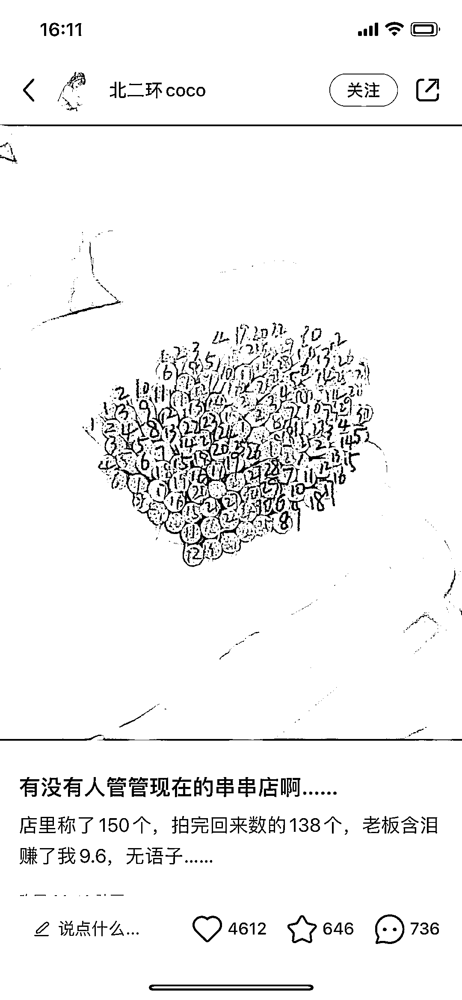
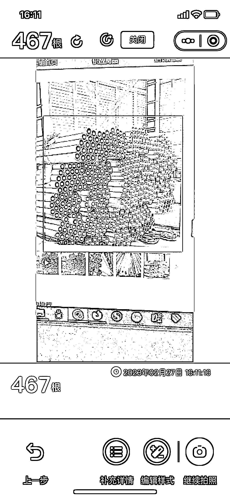
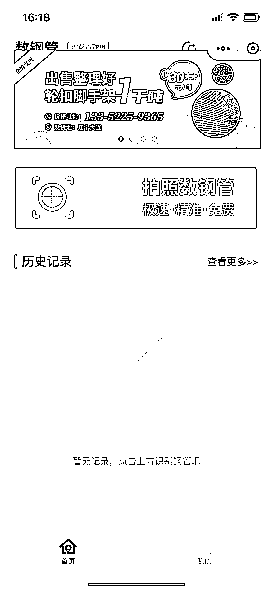

# 工具类小程序：数钢管，串串

> 原文：[`www.yuque.com/for_lazy/xkrm14/fhdzghz36z1ioav7`](https://www.yuque.com/for_lazy/xkrm14/fhdzghz36z1ioav7)

作者： 扑克脸的兔 

日期：2023-02-27 

点赞数：14 

正文： 

通过小红书评论区发现可以帮忙点数量的小程序，比如点数相机，猛秦等，准确度还凑合，工具挺实用，且小程序只做了钢管类广告位招租，应该还有发散空间 

  

  

  

评论区： 

Z 先生 : 有意思哈 

蓝色眼镜 : 撸串后的结算 

