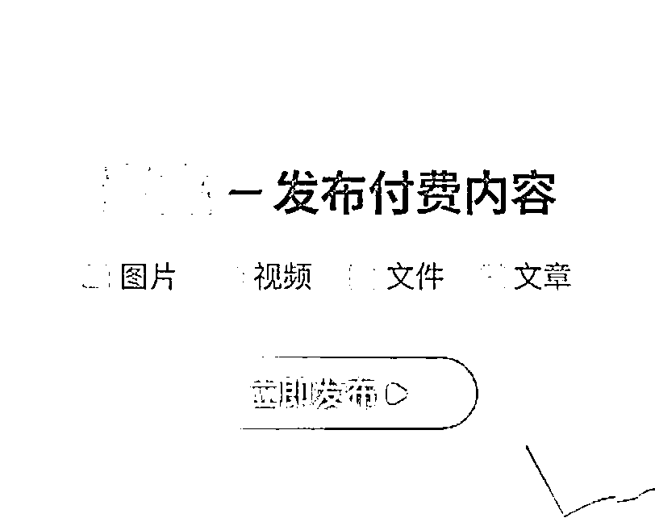
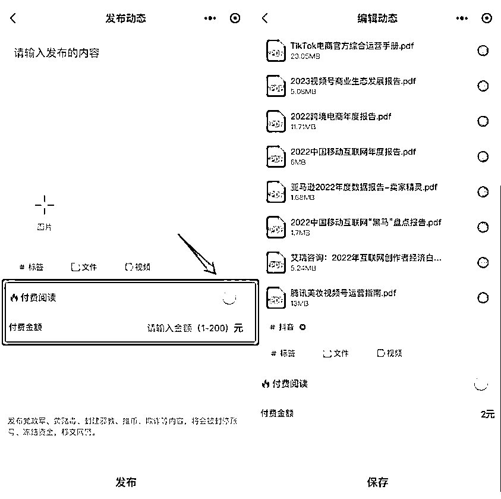

# 一个好用的赚钱工具：麦完小程序

> 原文：[`www.yuque.com/for_lazy/xkrm14/wo3qnwidaizlnl8t`](https://www.yuque.com/for_lazy/xkrm14/wo3qnwidaizlnl8t)

<ne-p id="u35cdb089" data-lake-id="u35cdb089"><ne-text id="ud594383e">作者： 生财王子</ne-text></ne-p> <ne-p id="u44c463a1" data-lake-id="u44c463a1"><ne-text id="u439634a6">日期：2023-02-27</ne-text></ne-p> <ne-p id="ua52d2e7d" data-lake-id="ua52d2e7d"><ne-text id="u94f29625">点赞数：</ne-text><ne-text id="u5d496818" ne-bold="true">18</ne-text></ne-p> <ne-hole id="u1a92c7a8" data-lake-id="u1a92c7a8"><ne-card data-card-name="hr" data-card-type="block" id="gajRQ" data-event-boundary="card"><ne-p id="u617c1a3c" data-lake-id="u617c1a3c"><ne-text id="ued7e9d4d">正文：</ne-text></ne-p> <ne-p id="u54f5e8c1" data-lake-id="u54f5e8c1"><ne-text id="uab0d65f1">一个好用的赚钱工具 适合做公众号、社群以及有资源的朋友。 这个产品叫——麦完小程序！ 目前是小程序版本，大家直接在小程序搜索即可。</ne-text> <ne-text id="ue79dabe4">用麦完你可以发布纯文字内容、也可以发布图片、视频、各种电子 pdf、word、表格，也同样可以发布长文章，支持多种资料混合上传。</ne-text></ne-p> <ne-p id="ub8c6f108" data-lake-id="ub8c6f108"><ne-card data-card-name="image" data-card-type="inline" id="pptis" data-event-boundary="card"></ne-card></ne-p> <ne-p id="udef64e02" data-lake-id="udef64e02"><ne-card data-card-name="image" data-card-type="inline" id="u5iFK" data-event-boundary="card">  <ne-hole id="ua9826629" data-lake-id="ua9826629"><ne-card data-card-name="hr" data-card-type="block" id="dzGI6" data-event-boundary="card"><ne-p id="u17dcc278" data-lake-id="u17dcc278"><ne-text id="u2907d847">评论区：</ne-text></ne-p> <ne-p id="u6401b8c4" data-lake-id="u6401b8c4"><ne-text id="u32adfa4e">暂无评论</ne-text></ne-p> <ne-hole id="u4cf84fc4" data-lake-id="u4cf84fc4"><ne-card data-card-name="hr" data-card-type="block" id="HI2mi" data-event-boundary="card"><ne-p id="u792d01af" data-lake-id="u792d01af"><ne-text id="ucf65debb">公众号懒人找资源，懒人专属群分享</ne-text></ne-p></ne-card></ne-hole></ne-card></ne-hole></ne-card></ne-p></ne-card></ne-hole>