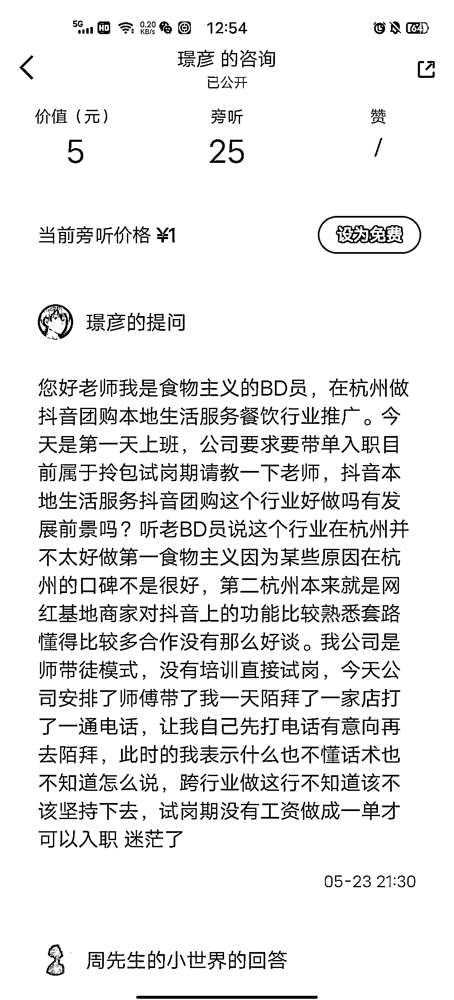
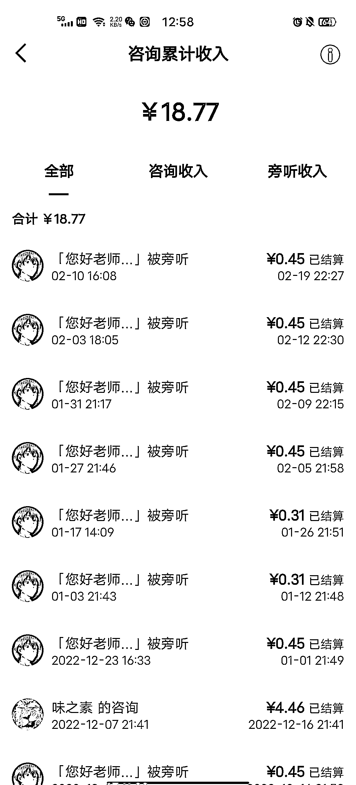

# 知乎开通付费问答，旁听也有收益

> 原文：[`www.yuque.com/for_lazy/xkrm14/gyvrct4lhpwry4vf`](https://www.yuque.com/for_lazy/xkrm14/gyvrct4lhpwry4vf)

<ne-p id="udfd294a9" data-lake-id="udfd294a9"><ne-text id="u21154559">作者： 周先生</ne-text></ne-p> <ne-p id="uf44db27a" data-lake-id="uf44db27a"><ne-text id="u08d826c9">日期：2023-03-03</ne-text></ne-p> <ne-p id="u57234f9e" data-lake-id="u57234f9e"><ne-text id="ud25b3e2a">点赞数：</ne-text><ne-text id="u1083c1d5" ne-bold="true">91</ne-text></ne-p> <ne-hole id="ud9c9228f" data-lake-id="ud9c9228f"><ne-card data-card-name="hr" data-card-type="block" id="Reorj" data-event-boundary="card"><ne-p id="u54a2c238" data-lake-id="u54a2c238"><ne-text id="u3afee174">正文：</ne-text></ne-p> <ne-p id="u4f4d12c0" data-lake-id="u4f4d12c0"><ne-text id="ufc58d07f">刚刚打开知乎，发现一个有意思的事， 我之前发布了一个抖音团购的咨询，5 元/次，有一个咨询，我回答后，就没在意，</ne-text> <ne-text id="udc017c49">但是我今天点进去一看，有十几块钱，都是旁听，旁听 1 元/人， 我就想，能不能这样玩，</ne-text> <ne-text id="u84c63ec6">做一个高客单咨询服务，收 999，找几个托去咨询，然后旁听价为 9.9，让大家觉得“蹭”到了高手的答案。</ne-text></ne-p> <ne-p id="u65bbce17" data-lake-id="u65bbce17"><ne-card data-card-name="image" data-card-type="inline" id="inYD3" data-event-boundary="card">  <ne-p id="ucbd83906" data-lake-id="ucbd83906"><ne-card data-card-name="image" data-card-type="inline" id="QVVy1" data-event-boundary="card">  <ne-hole id="ubc4e14af" data-lake-id="ubc4e14af"><ne-card data-card-name="hr" data-card-type="block" id="XVLcx" data-event-boundary="card"><ne-p id="u216830c5" data-lake-id="u216830c5"><ne-text id="ue8e9a1a1">评论区：</ne-text></ne-p> <ne-p id="ua94ab434" data-lake-id="ua94ab434"><ne-text id="ub54edc2e">宋词 : 我记得好像微博以前有付费回答可以花钱围观，还挺多人看的</ne-text></ne-p> <ne-p id="ud6b1d311" data-lake-id="ud6b1d311"><ne-text id="u25e632d9">Z 先生 : 很有意思，可以玩一玩</ne-text></ne-p> <ne-p id="u97b3ccbf" data-lake-id="u97b3ccbf"><ne-text id="u05d8a7a8">twinkle : 如何做知乎咨询？这个有意思.</ne-text></ne-p> <ne-p id="u181f6ddb" data-lake-id="u181f6ddb"><ne-text id="u89719a3b">周先生 : 直接去发布咨询，自己定价</ne-text></ne-p> <ne-p id="u62bc55d6" data-lake-id="u62bc55d6"><ne-text id="u124577b1">姬小光 : 在行好像也有</ne-text></ne-p> <ne-p id="ud5a228e8" data-lake-id="ud5a228e8"><ne-text id="u9eeb4e7b">千维 : 需要知乎账号到达四级 注册时间大于 90 天 90 天内账号活跃度大于 45 天</ne-text></ne-p> <ne-p id="ua4ea8201" data-lake-id="ua4ea8201"><ne-text id="ud4b8de4d">乐希 : 看样子知乎是扣 55%吗，999 元三个托成本是 550x3，不知道旁听的多不多。如果可以引流高客单可能可以尝试，知乎上的课基本上都是低价课</ne-text></ne-p> <ne-p id="u3c4049a6" data-lake-id="u3c4049a6"><ne-text id="uabbf27c8">twinkle : 已找到入口，谢谢😊</ne-text></ne-p> <ne-hole id="u9b25ca9e" data-lake-id="u9b25ca9e"><ne-card data-card-name="hr" data-card-type="block" id="sbmlz" data-event-boundary="card"><ne-p id="u9f9d7f12" data-lake-id="u9f9d7f12"><ne-text id="u7eafae05">公众号懒人找资源，懒人专属群分享</ne-text></ne-p></ne-card></ne-hole></ne-card></ne-hole></ne-card></ne-p></ne-card></ne-p></ne-card></ne-hole>