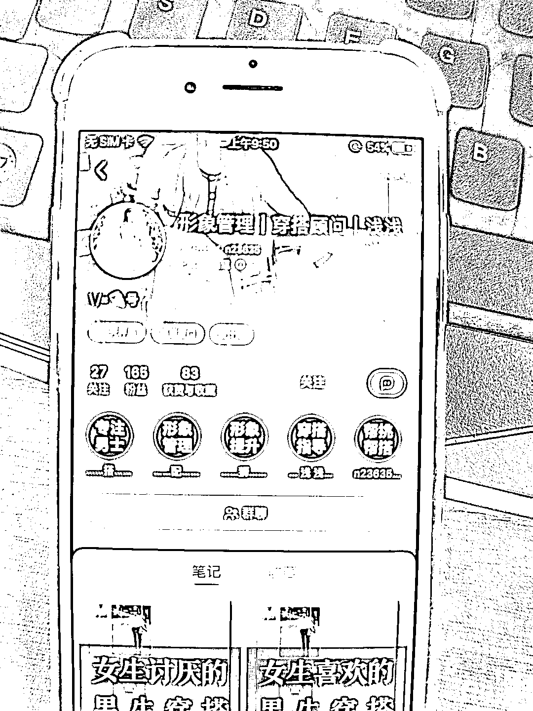
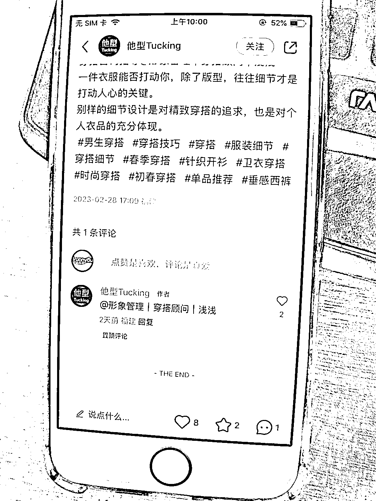

# 小红书账号男生形象付费指导，多重变现思路

> 原文：[`www.yuque.com/for_lazy/xkrm14/laovr0sgcn8gqy5z`](https://www.yuque.com/for_lazy/xkrm14/laovr0sgcn8gqy5z)

作者： 老彭 

日期：2023-03-03 

点赞数：52 

正文： 

这个账号的定位和引流都做得很有借鉴价值… 定位做的是男生形象付费指导(小红书男生越来越多，而且愿意玩小红书的男生大多也会在这种氛围下产生形象改造的需求，所以需求量只会越来越大) 变现模式做得也挺好，398/半年，698/一年，大多数男生不太愿意花时间研究穿搭，只会偶尔咨询一下，但需求可能都在，还是有可能触发续费，再加上年年都有刚上大学渴望改造的群体… 引流方式花样也多: 1、简介推小号引流 2、评论区艾特小号引流 3、瞬间打造引流 4、群引流，笔记挂群聊快速引导，群名(看群公告+v，我去举报了居然没通过，看来可以用？) 5、置顶笔记引流 

  

  

  

  

  

评论区： 

萤火虫 : 刚需 

瓜满楼 : 感觉现在的男生老扣了，太难了 

X.N : 哈哈哈 真实 

谢不言｜小红书电商 : 你说得对 

