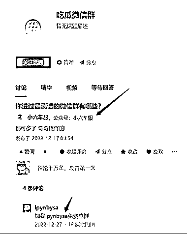

# 知乎垄断式流量池

> 原文：[`www.yuque.com/for_lazy/xkrm14/tp4mlnobi5y3mfdx`](https://www.yuque.com/for_lazy/xkrm14/tp4mlnobi5y3mfdx)

作者： 张柯 Ker 

日期：2023-03-02 

点赞数：44 

正文： 

知乎垄断式流量池，只有一个回答 

  

  

  

评论区： 

家蒙 : 张柯这个发现牛逼 

