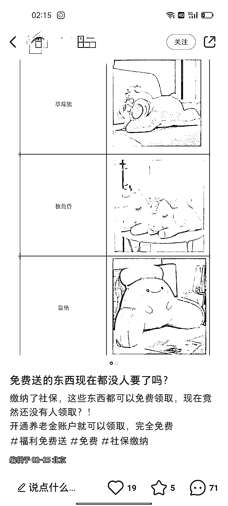

# 小红书的养老金拉新项目，引流到私域变现

> 原文：[`www.yuque.com/for_lazy/xkrm14/oceudm2ygge7y1t9`](https://www.yuque.com/for_lazy/xkrm14/oceudm2ygge7y1t9)

作者： 明月几时有 

日期：2023-03-01 

点赞数：37 

正文： 

小红书上的养老金拉新项目，以免费送为钩子，引流到私域，开通养老金，然后免费领取礼物 类似的拉新项目也可以免费送为由，开通就免费领取🎁礼物 评论区用小号多安排几个水军，点赞收藏评论 

 

 

评论区： 

詹伟平 : 看来养老金真的不一定是好事了 

谢不言｜小红书电商 : 哈哈哈哥你的思路清奇 

