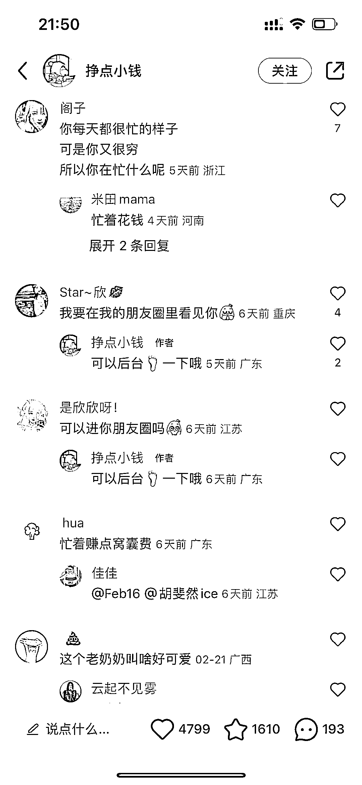

# 小红书：朋友圈文案笔记，引流加微信

> 原文：[`www.yuque.com/for_lazy/xkrm14/bfofai47sr8vxl6b`](https://www.yuque.com/for_lazy/xkrm14/bfofai47sr8vxl6b)

作者： 多闻 

日期：2023-02-28 

点赞数：44 

正文： 

这种小红书发文方式，引流了很多加微信，看朋友圈。 

  

  

  

  

  

评论区： 

