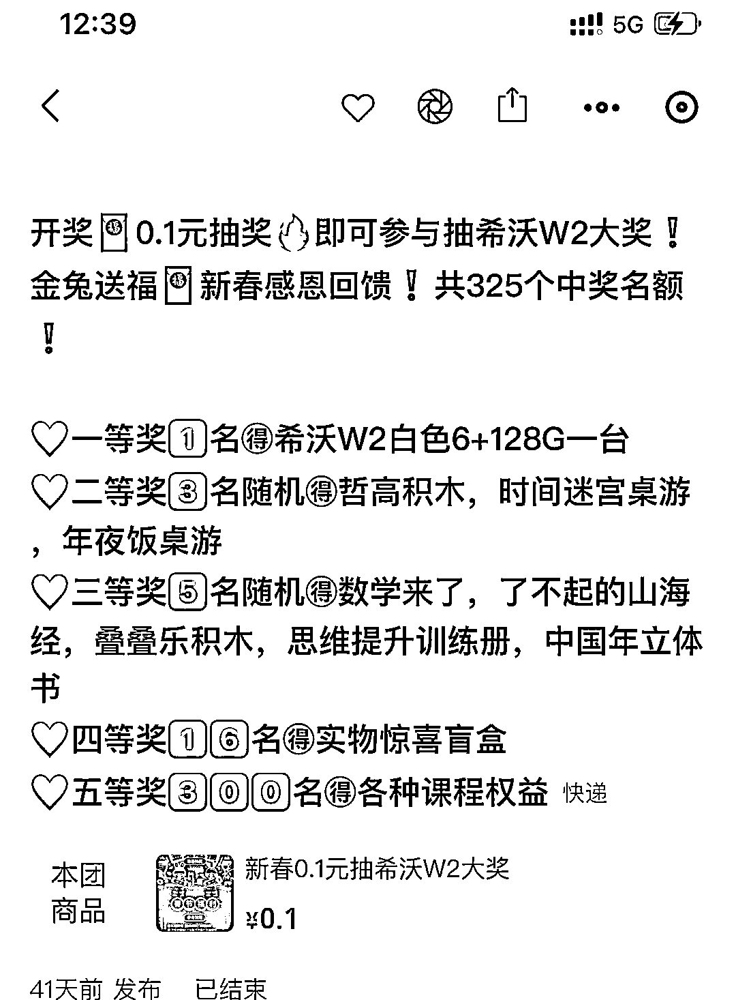
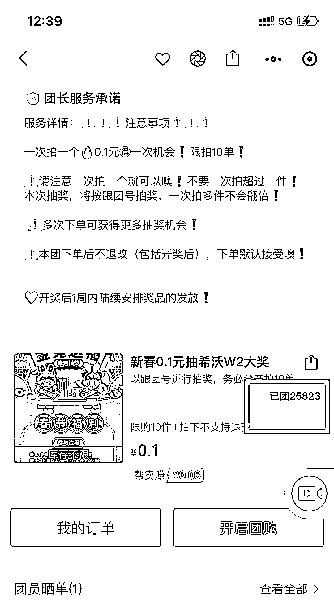

# 快团团利用抽奖，增加客户粘性，引导订阅自己的快团

> 原文：[`www.yuque.com/for_lazy/xkrm14/cdxmwd2hdanygi1h`](https://www.yuque.com/for_lazy/xkrm14/cdxmwd2hdanygi1h)

作者： 韵韵 

日期：2023-02-28 

点赞数：14 

正文： 

快团团里有些大团长，会对申请分销的团长的【跟团人数】和【跟团人次】有数量要求 这方面的数据可以通过「抽奖」的形式 shua 上去，具体见图。 作用： 1.快团数据好看了； 2.增加客户粘性，当是给了一个福利，但实际上自己成本不高，如图，2.5w 人参与 0.1 元抽奖，实际进账已有 2500 元，大奖成本已回来。 3.引导客户【订阅】自己快团，并关注快团公众号，以后每次开团都会收到公号提醒。 

  

  

评论区： 

清华  : 要是 新团长 发圈，没几个团员 ，那参加的人少 ，中奖的概率就搞了，会不会就被撸羊毛走了 

韵韵 : 要搞的话，就不能只是发圈哇，各种私信用上 

清华  : 明白了，谢谢 

