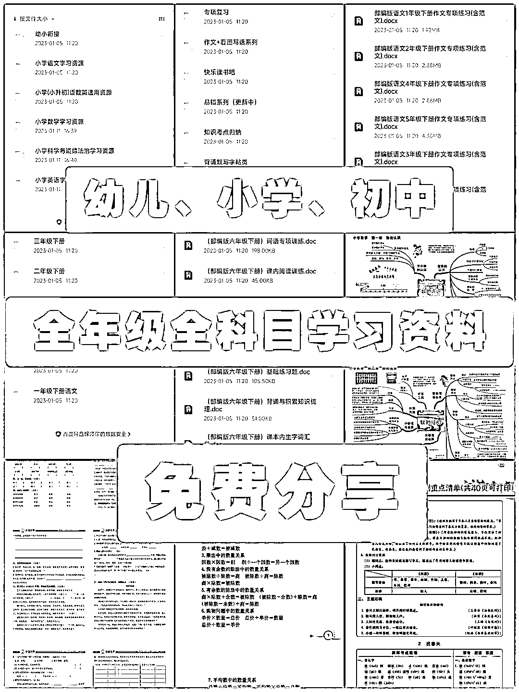
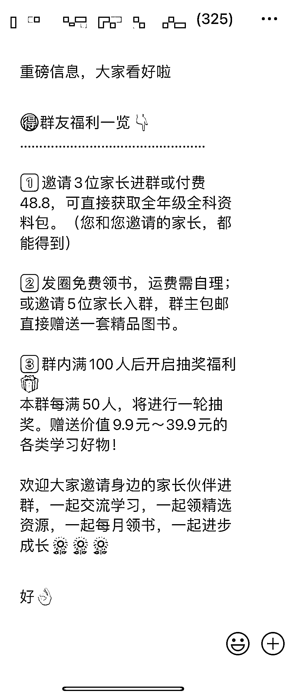

# 小红书通过公益领书引流到私域社群，裂变流程

> 原文：[`www.yuque.com/for_lazy/xkrm14/lse77hk9dp2mzf9f`](https://www.yuque.com/for_lazy/xkrm14/lse77hk9dp2mzf9f)

<ne-p id="u1bbccf4e" data-lake-id="u1bbccf4e"><ne-text id="u2cf6465b">作者： 韵韵</ne-text></ne-p> <ne-p id="u1c8a8507" data-lake-id="u1c8a8507"><ne-text id="u4a244b4b">日期：2023-02-28</ne-text></ne-p> <ne-p id="u3dc72ee5" data-lake-id="u3dc72ee5"><ne-text id="ude6eec03">点赞数：</ne-text><ne-text id="u3d890e95" ne-bold="true">46</ne-text></ne-p> <ne-hole id="ub5443058" data-lake-id="ub5443058"><ne-card data-card-name="hr" data-card-type="block" id="Y49Af" data-event-boundary="card"><ne-p id="ucd979953" data-lake-id="ucd979953"><ne-text id="u1637c989">正文：</ne-text></ne-p> <ne-p id="u6d8a5ade" data-lake-id="u6d8a5ade"><ne-text id="ud4ce073a">小红书通过公益领书引流到私域社群后如何继续裂变： 群内循环播报福利活动： 1.邀请 3 位家长进群，免费领 500G 0-15 岁学科资料；</ne-text> <ne-text id="uc1be94b2">2.邀请 5 位家长进群，免发圈送书。 建群后连续一周，每天红包抽奖送书或者其他学习周边产品，吸引群内成员留存+邀请。</ne-text> <ne-text id="uaaa707f4">送出资料和奖品的对话，即时打码发布在社群，吸引群内成员参与活动。 每个被邀请进群的家长，都加微信发放资料，裂变成本为 0。</ne-text> <ne-text id="u21b93997">潜伏一周，第三天群人数就从五十多人拉到 300+人，群内活跃度还不错。</ne-text></ne-p> <ne-p id="ua4413e78" data-lake-id="ua4413e78"><ne-card data-card-name="image" data-card-type="inline" id="pqHL2" data-event-boundary="card">  <ne-p id="u7defaf7c" data-lake-id="u7defaf7c"><ne-card data-card-name="image" data-card-type="inline" id="UBRT8" data-event-boundary="card">  <ne-p id="ueadf1543" data-lake-id="ueadf1543"><ne-card data-card-name="image" data-card-type="inline" id="AHzCt" data-event-boundary="card">  <ne-p id="ub3e3aae7" data-lake-id="ub3e3aae7"><ne-card data-card-name="image" data-card-type="inline" id="WuEYl" data-event-boundary="card">  <ne-p id="uaeca3813" data-lake-id="uaeca3813"><ne-card data-card-name="image" data-card-type="inline" id="rOCa0" data-event-boundary="card">  <ne-hole id="u70da86b5" data-lake-id="u70da86b5"><ne-card data-card-name="hr" data-card-type="block" id="dZmBS" data-event-boundary="card"><ne-p id="u5ffc7db9" data-lake-id="u5ffc7db9"><ne-text id="u214dcdea">评论区：</ne-text></ne-p> <ne-p id="u1ffc1bd4" data-lake-id="u1ffc1bd4"><ne-text id="u811754ec">星星 : 明天就做一下试试，感谢分享</ne-text></ne-p> <ne-p id="ue20d8fba" data-lake-id="ue20d8fba"><ne-text id="u63e55e97">韵韵 : 期待反馈效果</ne-text></ne-p> <ne-p id="u20e44cba" data-lake-id="u20e44cba"><ne-text id="udc4305c4">Sky : 后期有什么变现的方向吗？</ne-text></ne-p> <ne-p id="ub200ac99" data-lake-id="ub200ac99"><ne-text id="u19e4aadc">韵韵 : 宝妈粉，变现方向还是很多的，也有教育平台依托。</ne-text></ne-p> <ne-p id="u98ca468d" data-lake-id="u98ca468d"><ne-text id="ue8572e29">十七(瘦到 140) : 网盘拉新，了解一下</ne-text></ne-p> <ne-p id="uea0b9a7c" data-lake-id="uea0b9a7c"><ne-text id="u380e3a34">韵韵 : 求资源</ne-text></ne-p> <ne-p id="u5a44187d" data-lake-id="u5a44187d"><ne-text id="u1aaf83c8">十七(瘦到 140) : 我没这方面资源，圈友肯定有，你星球发个求助帖试试</ne-text></ne-p> <ne-p id="u7ca4febd" data-lake-id="u7ca4febd"><ne-text id="u5a35b3d7">韵韵 : 好的感谢</ne-text></ne-p> <ne-hole id="u6e17b028" data-lake-id="u6e17b028"><ne-card data-card-name="hr" data-card-type="block" id="bTqw1" data-event-boundary="card"><ne-p id="uf35d6d2f" data-lake-id="uf35d6d2f"><ne-text id="ubf790ef6">公众号懒人找资源，懒人专属群分享</ne-text></ne-p></ne-card></ne-hole></ne-card></ne-hole></ne-card></ne-p></ne-card></ne-p></ne-card></ne-p></ne-card></ne-p></ne-card></ne-p></ne-card></ne-hole>