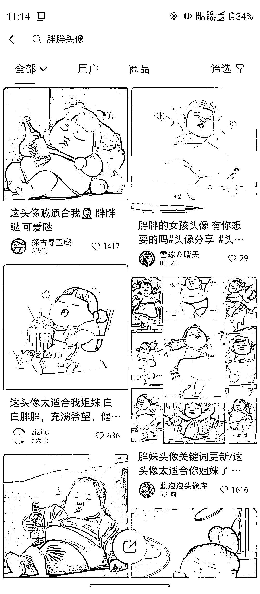

# 小红书闺蜜头像主题

> 原文：[`www.yuque.com/for_lazy/xkrm14/zsnt7d390rl0tl2v`](https://www.yuque.com/for_lazy/xkrm14/zsnt7d390rl0tl2v)

<ne-p id="ucc069fec" data-lake-id="ucc069fec"><ne-text id="u22b147c0">作者： 阿迪</ne-text></ne-p> <ne-p id="u608a8393" data-lake-id="u608a8393"><ne-text id="uc1c2c2b5">日期：2023-02-27</ne-text></ne-p> <ne-p id="u63cab4e6" data-lake-id="u63cab4e6"><ne-text id="ub49bce02">点赞数：</ne-text><ne-text id="ucffbb8fc" ne-bold="true">25</ne-text></ne-p> <ne-hole id="u4f3c57b5" data-lake-id="u4f3c57b5"><ne-card data-card-name="hr" data-card-type="block" id="OyPmm" data-event-boundary="card"><ne-p id="u10f76410" data-lake-id="u10f76410"><ne-text id="ua4742fe8">正文：</ne-text></ne-p> <ne-p id="ueb869a70" data-lake-id="ueb869a70"><ne-text id="u9a11dc9a">闺蜜头像主题，小红书上有几个账号比较火，用于小程序引流、私域流量</ne-text></ne-p> <ne-p id="u414f5eca" data-lake-id="u414f5eca"><ne-card data-card-name="image" data-card-type="inline" id="BlaJi" data-event-boundary="card">  <ne-hole id="ubb6c66a1" data-lake-id="ubb6c66a1"><ne-card data-card-name="hr" data-card-type="block" id="jzL1y" data-event-boundary="card"><ne-p id="u46ae4846" data-lake-id="u46ae4846"><ne-text id="ua7b8d40f">评论区：</ne-text></ne-p> <ne-p id="ue181a8aa" data-lake-id="ue181a8aa"><ne-text id="u8c329c49">清华  : 名字取的真好。闺蜜头像，闺蜜胖，自己美[呲牙]</ne-text></ne-p> <ne-hole id="ud3626eaa" data-lake-id="ud3626eaa"><ne-card data-card-name="hr" data-card-type="block" id="L6FGx" data-event-boundary="card"><ne-p id="uf0488621" data-lake-id="uf0488621"><ne-text id="uaffcbd9d">公众号懒人找资源，懒人专属群分享</ne-text></ne-p></ne-card></ne-hole></ne-card></ne-hole></ne-card></ne-p></ne-card></ne-hole>