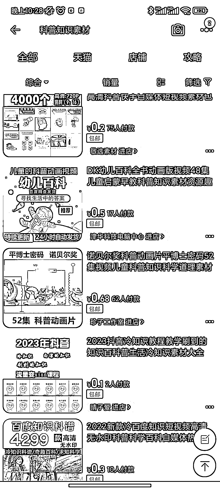
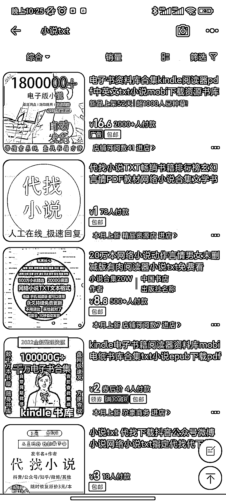

# 淘宝虚拟产品，短视频素材

> 原文：[`www.yuque.com/for_lazy/xkrm14/newkbhxby2ust8g3`](https://www.yuque.com/for_lazy/xkrm14/newkbhxby2ust8g3)

<ne-p id="ua9fd25b4" data-lake-id="ua9fd25b4"><ne-text id="u76fa729d">作者： 零</ne-text></ne-p> <ne-p id="u192e5c55" data-lake-id="u192e5c55"><ne-text id="uae867562">日期：2023-02-27</ne-text></ne-p> <ne-p id="u8cfbb39a" data-lake-id="u8cfbb39a"><ne-text id="u10b57af6">点赞数：</ne-text><ne-text id="ub53fe87f" ne-bold="true">23</ne-text></ne-p> <ne-hole id="u13105334" data-lake-id="u13105334"><ne-card data-card-name="hr" data-card-type="block" id="DlNCC" data-event-boundary="card"><ne-p id="u1d14157a" data-lake-id="u1d14157a"><ne-text id="u34392103">正文：</ne-text></ne-p> <ne-p id="u2a9d9078" data-lake-id="u2a9d9078"><ne-text id="u818bc143">短视频发展到现在，其实很多内容并不需要你从头开始做的，比如想做科普号，想做故事号的，也不一定要从怎么一个个找对标账号开始的。淘宝都有现成的。等你使劲铺了起来一个号，要用哪些素材自然而然的就有把握了。</ne-text></ne-p> <ne-p id="uc72fe039" data-lake-id="uc72fe039"><ne-card data-card-name="image" data-card-type="inline" id="hjhiF" data-event-boundary="card">  <ne-p id="ub33030ad" data-lake-id="ub33030ad"><ne-card data-card-name="image" data-card-type="inline" id="aU5b6" data-event-boundary="card">  <ne-p id="udb8c2932" data-lake-id="udb8c2932"><ne-card data-card-name="image" data-card-type="inline" id="IMLgX" data-event-boundary="card">  <ne-hole id="u367be566" data-lake-id="u367be566"><ne-card data-card-name="hr" data-card-type="block" id="jvXQn" data-event-boundary="card"><ne-p id="u991d93be" data-lake-id="u991d93be"><ne-text id="u6881f425">评论区：</ne-text></ne-p> <ne-p id="ub1bdb7cd" data-lake-id="ub1bdb7cd"><ne-text id="u3af69d3c">暂无评论</ne-text></ne-p> <ne-hole id="udc6a905d" data-lake-id="udc6a905d"><ne-card data-card-name="hr" data-card-type="block" id="f49Kv" data-event-boundary="card"><ne-p id="u71bee2be" data-lake-id="u71bee2be"><ne-text id="uf5963106">公众号懒人找资源，懒人专属群分享</ne-text></ne-p></ne-card></ne-hole></ne-card></ne-hole></ne-card></ne-p></ne-card></ne-p></ne-card></ne-p></ne-card></ne-hole>