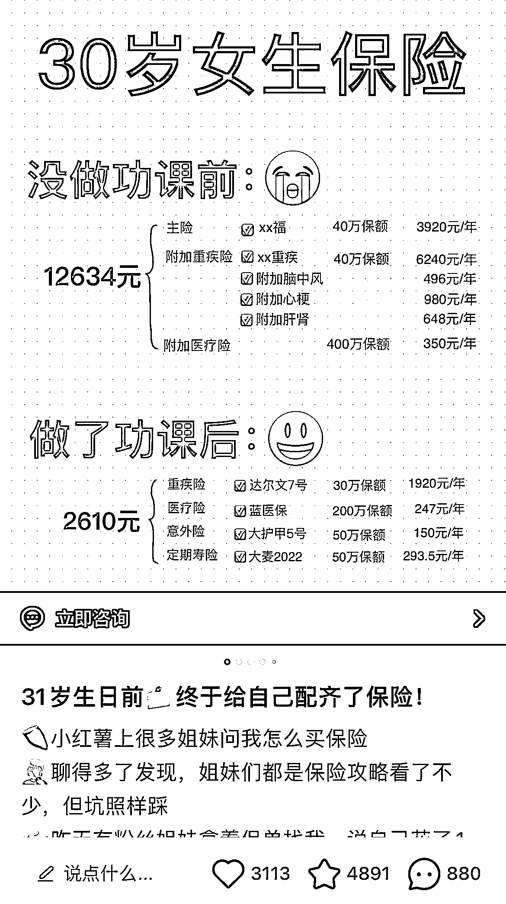

# 小红书保险类笔记，爆款写法推荐

> 原文：[`www.yuque.com/for_lazy/xkrm14/tz1y14qnsob6l7gz`](https://www.yuque.com/for_lazy/xkrm14/tz1y14qnsob6l7gz)

作者： 梁靠谱 

日期：2023-02-27 

点赞数：13 

正文： 

小红书帖子，保险类，标题一定要自带目标人群，以及前后对比，金额要明显，流量很大。 

  

评论区： 

安神 : 低粉爆款笔记，而且还投了蒲公英的，确实值得学习套用这个 

麦洛 : 投的是聚光 

