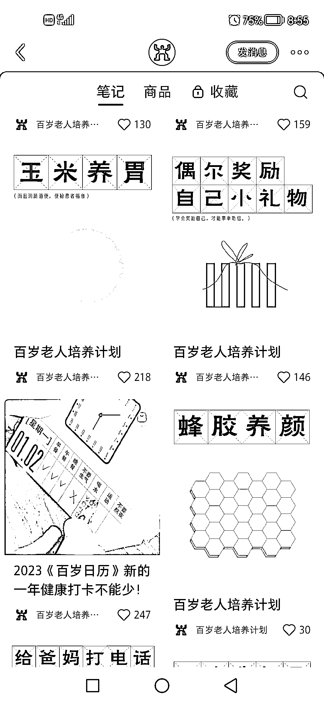

# 小红书账号定位服务老人，后期多种方式变现

> 原文：[`www.yuque.com/for_lazy/xkrm14/egv6ug8r8s6r32zo`](https://www.yuque.com/for_lazy/xkrm14/egv6ug8r8s6r32zo)

<ne-p id="u936b73c8" data-lake-id="u936b73c8"><ne-text id="u976df762">作者： 老彭</ne-text></ne-p> <ne-p id="u9c1dd37c" data-lake-id="u9c1dd37c"><ne-text id="uca535a1f">日期：2023-02-27</ne-text></ne-p> <ne-p id="u0b1a2541" data-lake-id="u0b1a2541"><ne-text id="ub20ef896">点赞数：</ne-text><ne-text id="uf789bf25" ne-bold="true">29</ne-text></ne-p> <ne-hole id="u8bd237e6" data-lake-id="u8bd237e6"><ne-card data-card-name="hr" data-card-type="block" id="e23M2" data-event-boundary="card"><ne-p id="u8bd7d75f" data-lake-id="u8bd7d75f"><ne-text id="ua0533e34">正文：</ne-text></ne-p> <ne-p id="u16e64eb3" data-lake-id="u16e64eb3"><ne-text id="uae313312">这个账号的定位是真优秀，数据很容易起来，也很容易插入广告，养生、美食、礼品等好多都可以带</ne-text> <ne-text id="u7a38c304">(做一个好的定位，真的可以避免很多盲目努力，如果实在不知道自己要做什么定位，不妨模仿别人做的优秀定位啊)</ne-text></ne-p> <ne-p id="u964acff1" data-lake-id="u964acff1"><ne-card data-card-name="image" data-card-type="inline" id="fTWI6" data-event-boundary="card">  <ne-p id="u15a31c2a" data-lake-id="u15a31c2a"><ne-card data-card-name="image" data-card-type="inline" id="rwhaA" data-event-boundary="card">  <ne-hole id="u5a40f08a" data-lake-id="u5a40f08a"><ne-card data-card-name="hr" data-card-type="block" id="i7BdE" data-event-boundary="card"><ne-p id="uac6e3b3e" data-lake-id="uac6e3b3e"><ne-text id="u0f401d7c">评论区：</ne-text></ne-p> <ne-p id="u7e1c7cda" data-lake-id="u7e1c7cda"><ne-text id="uc05c7652">暂无评论</ne-text></ne-p> <ne-hole id="u39b4f768" data-lake-id="u39b4f768"><ne-card data-card-name="hr" data-card-type="block" id="ND3C9" data-event-boundary="card"><ne-p id="u1ca7b2a0" data-lake-id="u1ca7b2a0"><ne-text id="u0ebdc350">公众号懒人找资源，懒人专属群分享</ne-text></ne-p></ne-card></ne-hole></ne-card></ne-hole></ne-card></ne-p></ne-card></ne-p></ne-card></ne-hole>