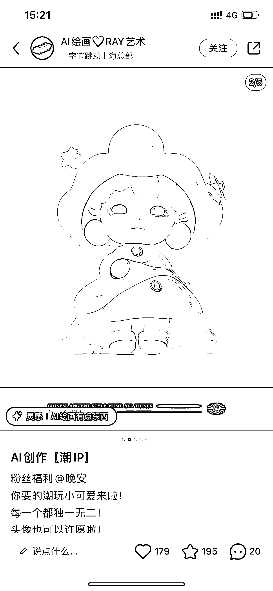

# 用 AI 关键词 tag 做手办

> 原文：[`www.yuque.com/for_lazy/xkrm14/of64ebv4ast5truq`](https://www.yuque.com/for_lazy/xkrm14/of64ebv4ast5truq)

<ne-p id="u4248270c" data-lake-id="u4248270c"><ne-text id="u3db82ea6">作者： 冯冯 FOX</ne-text></ne-p> <ne-p id="ud0eeb584" data-lake-id="ud0eeb584"><ne-text id="u90a1b596">日期：2023-03-02</ne-text></ne-p> <ne-p id="u39955e33" data-lake-id="u39955e33"><ne-text id="u8bd01117">点赞数：</ne-text><ne-text id="u2a30fd60" ne-bold="true">39</ne-text></ne-p> <ne-hole id="u57bb8d15" data-lake-id="u57bb8d15"><ne-card data-card-name="hr" data-card-type="block" id="sNbRJ" data-event-boundary="card"><ne-p id="uc0971eba" data-lake-id="uc0971eba"><ne-text id="u0fe353e7">正文：</ne-text></ne-p> <ne-p id="uc8fb3911" data-lake-id="uc8fb3911"><ne-text id="u7157e2cb">作为设计师，看到这个用 AI 关键词 tag 做出来的手办，手都抖了发这条风向标，以前以为 chatgpt 最先取代文职类的工作，原来做设计的也是一根绳上的蚂蚱。</ne-text></ne-p> <ne-p id="ud0f14f70" data-lake-id="ud0f14f70"><ne-card data-card-name="image" data-card-type="inline" id="UWWJD" data-event-boundary="card"></ne-card></ne-p> <ne-p id="u56e25861" data-lake-id="u56e25861"><ne-card data-card-name="image" data-card-type="inline" id="hpP4R" data-event-boundary="card"></ne-card></ne-p> <ne-hole id="u5e45c31e" data-lake-id="u5e45c31e"><ne-card data-card-name="hr" data-card-type="block" id="SulzS" data-event-boundary="card"><ne-p id="u30c5d6f4" data-lake-id="u30c5d6f4"><ne-text id="u31fda2df">评论区：</ne-text></ne-p> <ne-p id="u7e493120" data-lake-id="u7e493120"><ne-text id="u551b6b31">暂无评论</ne-text></ne-p> <ne-hole id="ub54618ff" data-lake-id="ub54618ff"><ne-card data-card-name="hr" data-card-type="block" id="bRzgw" data-event-boundary="card"><ne-p id="uc77ce2e9" data-lake-id="uc77ce2e9"><ne-text id="uab3b60b9">公众号懒人找资源，懒人专属群分享</ne-text></ne-p></ne-card></ne-hole></ne-card></ne-hole></ne-card></ne-hole>