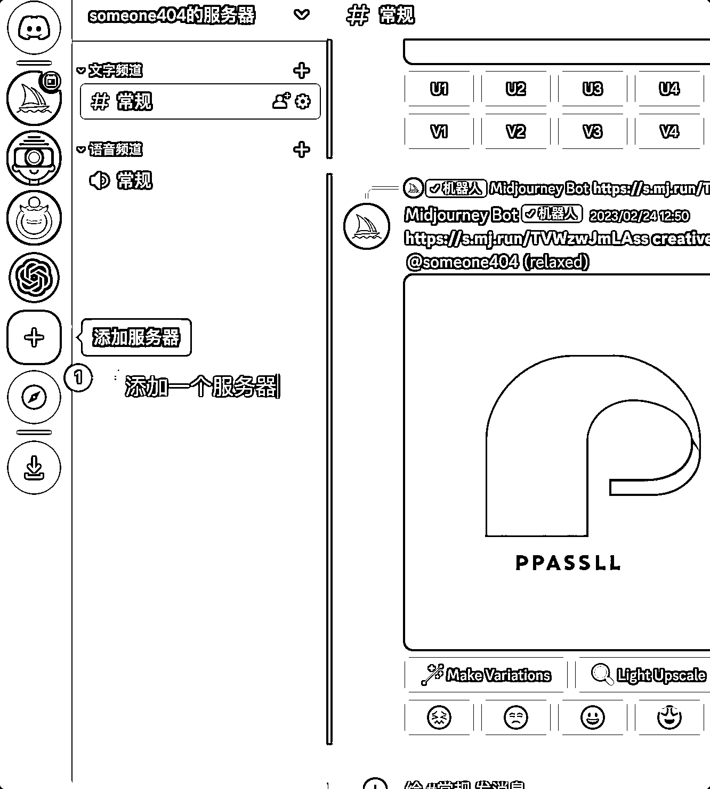
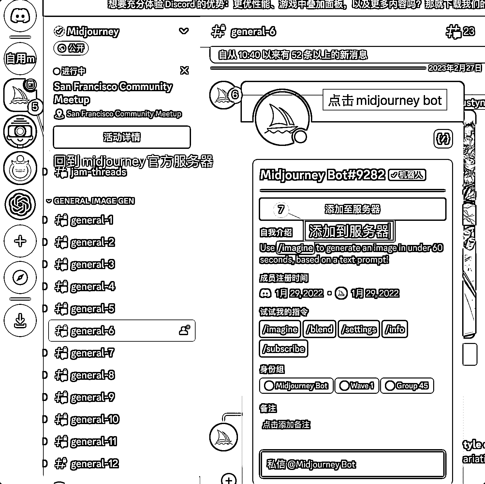
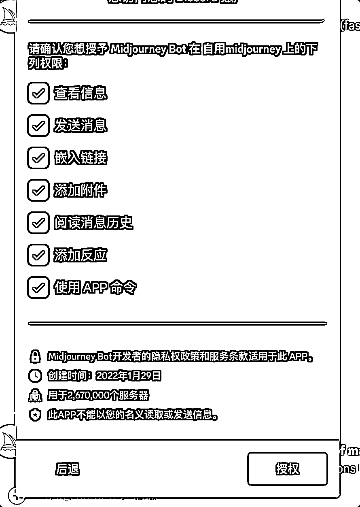
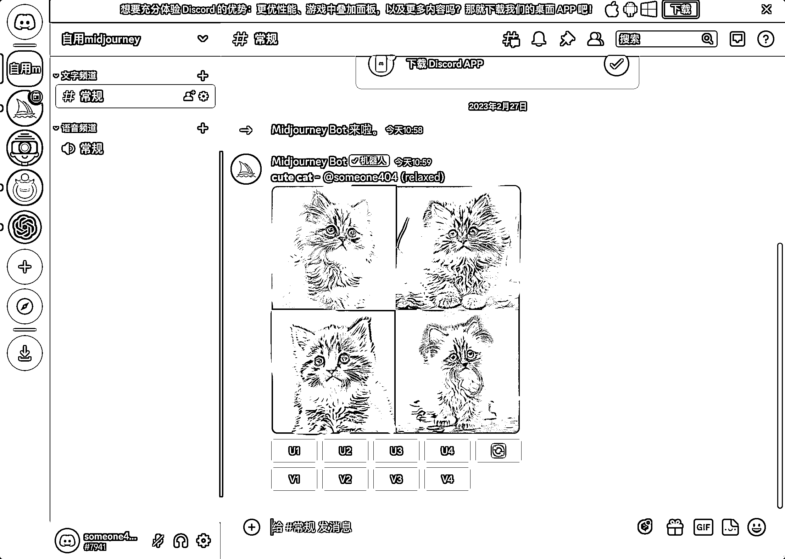

# Midjourney 的快速找图方法

> 原文：[`www.yuque.com/for_lazy/xkrm14/irsgcxrz1y4lbgfx`](https://www.yuque.com/for_lazy/xkrm14/irsgcxrz1y4lbgfx)

作者： iMairy 

日期：2023-02-27 

点赞数：33 

正文： 

看到群里小伙伴说 Midjourney 生成图每次总会被消息覆盖掉，分享一个我使用 Midjourney 的方法 

 

  

  

  

 

  

  

 

评论区： 

Luke 王子 : 超赞，看看后续使用情况~ 

小牛 : 按照方法已成功，感谢 

