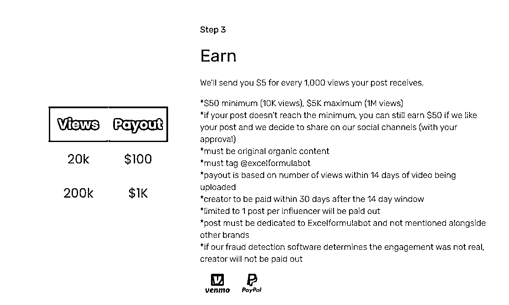

# excelformulabot，使用 ai 自动根据问题生成 excel 公式

> 原文：[`www.yuque.com/for_lazy/xkrm14/zfhvklouyysu0262`](https://www.yuque.com/for_lazy/xkrm14/zfhvklouyysu0262)

作者： 智昊 

日期：2023-02-27 

点赞数：13 

正文： 

excelformulabot，使用 ai 自动根据问题生成 excel 公式。现在在 tiktok 上发布关于 excelformulabot 的短视频，每 1000 个播放量给 5 美元。 网址： 短视频激励计划：[Excel+&+Google+Sheets+AI+Formula+Generator+-+Excel...](https://excelformulabot.com/) [Influencer+Marketing+Program+-+Excelformulabot](https://excelformulabot.com/influencer-program) 

 

 

评论区： 

暂无评论 

