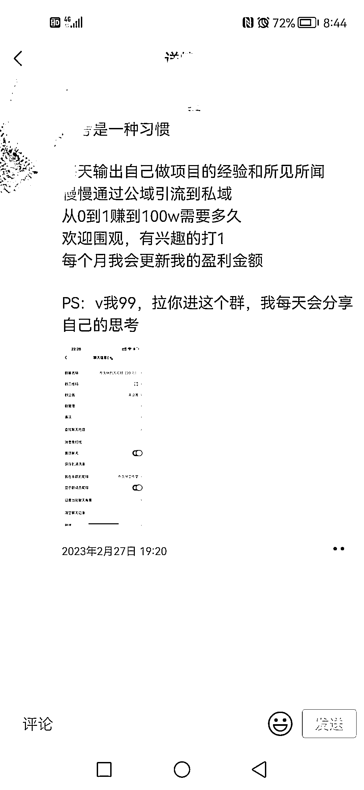

# 新媒体运营分享运营经验，公域引流到私域

> 原文：[`www.yuque.com/for_lazy/xkrm14/orpzc1qhsgpvz3ha`](https://www.yuque.com/for_lazy/xkrm14/orpzc1qhsgpvz3ha)

作者： 老彭 

日期：2023-03-01 

点赞数：71 

正文： 

刚加了一个圈友，看到他朋友圈这条内容，感觉是个不错的最小可用产品，很多圈友引流后都可以借鉴这个模式 比如我在公司说做新媒体运营，副业做了一个号讲运营，从公域引流到私域，就可以建个群讲自己每天的运营工作与思考，挺好的一个 mvp 模式 

  

评论区： 

Luke 王子 : 围观群 不错的想法~ 

竹隐 : Mvp 模式，不太理解 

老彭 : 就是打造一个最小可用产品，然后去跑销售，完成变现 

一一 : 慢慢的，满 XX 人涨价 XX，靠收群费完成 100 万😂 

某人周 : 围观群的模式，朴实好用 

