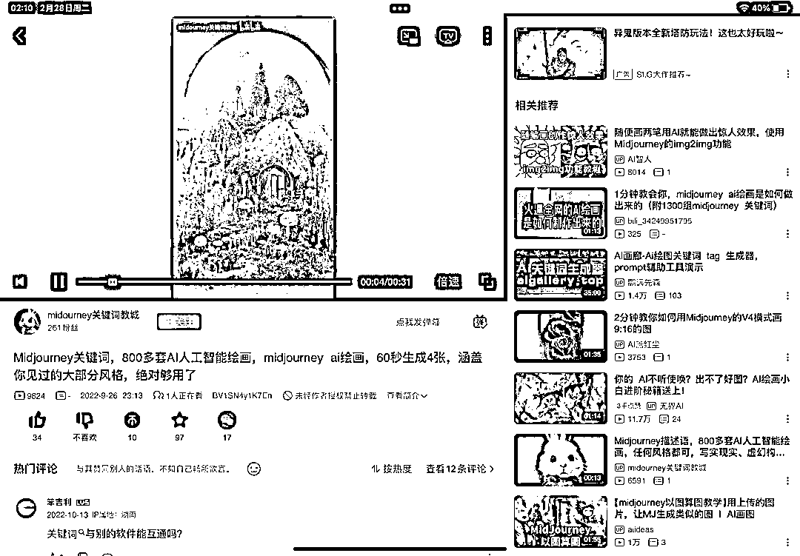
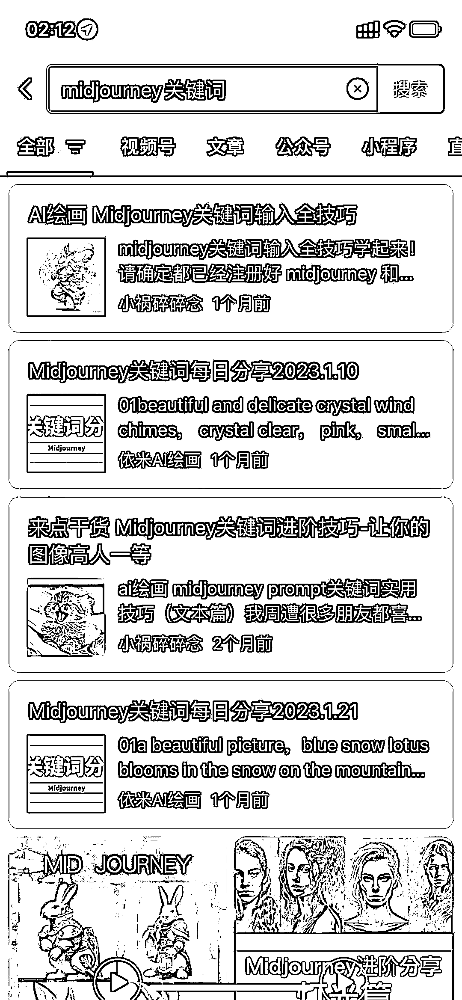

# 资料整理变现的多种操作方式

> 原文：[`www.yuque.com/for_lazy/xkrm14/nmaz16i0gky9mtwk`](https://www.yuque.com/for_lazy/xkrm14/nmaz16i0gky9mtwk)

<ne-p id="ude8299a8" data-lake-id="ude8299a8"><ne-text id="u6aa91fc5">作者： 小邹</ne-text></ne-p> <ne-p id="u3bc6a4ff" data-lake-id="u3bc6a4ff"><ne-text id="ubd254f6f">日期：2023-02-28</ne-text></ne-p> <ne-p id="ue34e545e" data-lake-id="ue34e545e"><ne-text id="u4f13a8cb">点赞数：</ne-text><ne-text id="u923a5127" ne-bold="true">41</ne-text></ne-p> <ne-hole id="u7c623605" data-lake-id="u7c623605"><ne-card data-card-name="hr" data-card-type="block" id="dPbhj" data-event-boundary="card"><ne-p id="u366d86df" data-lake-id="u366d86df"><ne-text id="ub048fdaa">正文：</ne-text></ne-p> <ne-p id="u9aea746d" data-lake-id="u9aea746d"><ne-text id="ud7dbc324">今天想收集一下 midjourney 的教学和关键词，抛开国外的网站及平台，至今为止我依然认为国内资讯最快且优质的教学视频依然是以中长视频为首的 B 站</ne-text> <ne-text id="uc16321d8">在整理过程中发现资料整理变现的方式好像也很多 可以把图片变成轮播，碰上舒缓音乐的就是一个非常治愈的画面，把视频进行售卖，也可定制</ne-text> <ne-text id="u6b466594">将视频变为直播，配上白噪音也能解决情绪需求了 而搜集资料最快来源就是图文、微信搜一搜、语雀广场、小红书图文、即刻这几个平台的信息也是非常丰富</ne-text> <ne-text id="u691906a3">检索资料，进行整理打包即可变为一个资料包、专栏、资料群，只要有人需要它就可以进行变现，把内容展示变成多元化，音频、视频、直播、PDF/PPT、图片等等</ne-text> <ne-text id="ub7892c7e">需要提高售价就去增加服务，帮对方答疑、帮对方整理、给对方发送（按月、按天、按次）均可以 把步骤说的很麻烦别人好像也就难得弄了，于是需求它来了</ne-text> <ne-text id="u3718fb62">把资料展示的很稀有大家好像就越想要，于是流量它来了 越是麻烦大家越懒得弄，越是难得大家越想要</ne-text></ne-p> <ne-p id="u3ad55345" data-lake-id="u3ad55345"><ne-card data-card-name="image" data-card-type="inline" id="lZCUp" data-event-boundary="card"></ne-card></ne-p> <ne-p id="u1bd4a0e7" data-lake-id="u1bd4a0e7"><ne-card data-card-name="image" data-card-type="inline" id="Ozc3d" data-event-boundary="card">  <ne-p id="uec67d130" data-lake-id="uec67d130"><ne-card data-card-name="image" data-card-type="inline" id="zWjrU" data-event-boundary="card"></ne-card></ne-p> <ne-p id="u29438c20" data-lake-id="u29438c20"><ne-card data-card-name="image" data-card-type="inline" id="LIDyH" data-event-boundary="card"></ne-card></ne-p> <ne-p id="uc68fdb32" data-lake-id="uc68fdb32"><ne-card data-card-name="image" data-card-type="inline" id="XDQi2" data-event-boundary="card"></ne-card></ne-p> <ne-p id="u8166e0cc" data-lake-id="u8166e0cc"><ne-card data-card-name="image" data-card-type="inline" id="q204f" data-event-boundary="card"></ne-card></ne-p> <ne-p id="ue839c605" data-lake-id="ue839c605"><ne-card data-card-name="image" data-card-type="inline" id="LyuVe" data-event-boundary="card"></ne-card></ne-p> <ne-hole id="u1704733a" data-lake-id="u1704733a"><ne-card data-card-name="hr" data-card-type="block" id="QZXgb" data-event-boundary="card"><ne-p id="ucba77666" data-lake-id="ucba77666"><ne-text id="ud242d011">评论区：</ne-text></ne-p> <ne-p id="u934fef58" data-lake-id="u934fef58"><ne-text id="ue2bd8052">暂无评论</ne-text></ne-p> <ne-hole id="udbe20362" data-lake-id="udbe20362"><ne-card data-card-name="hr" data-card-type="block" id="FpDix" data-event-boundary="card"><ne-p id="u5c078180" data-lake-id="u5c078180"><ne-text id="u3eb3d06b">公众号懒人找资源，懒人专属群分享</ne-text></ne-p></ne-card></ne-hole></ne-card></ne-hole></ne-card></ne-p></ne-card></ne-hole>